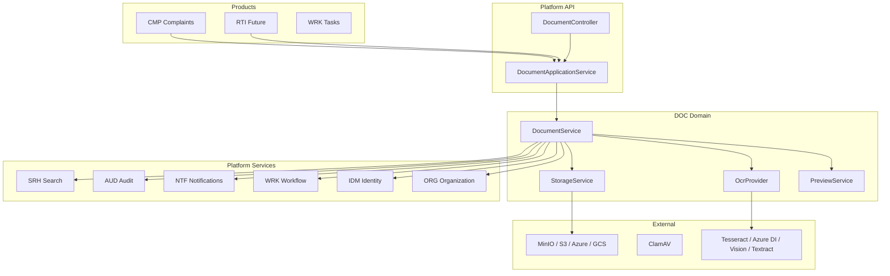
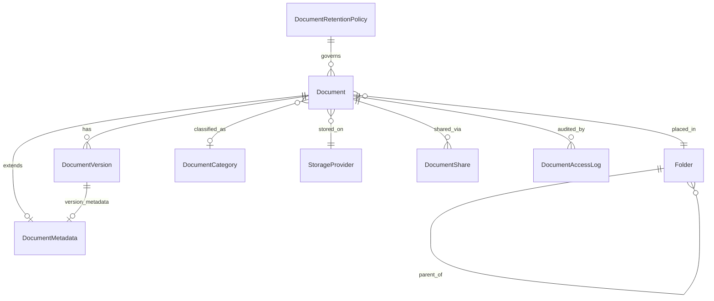
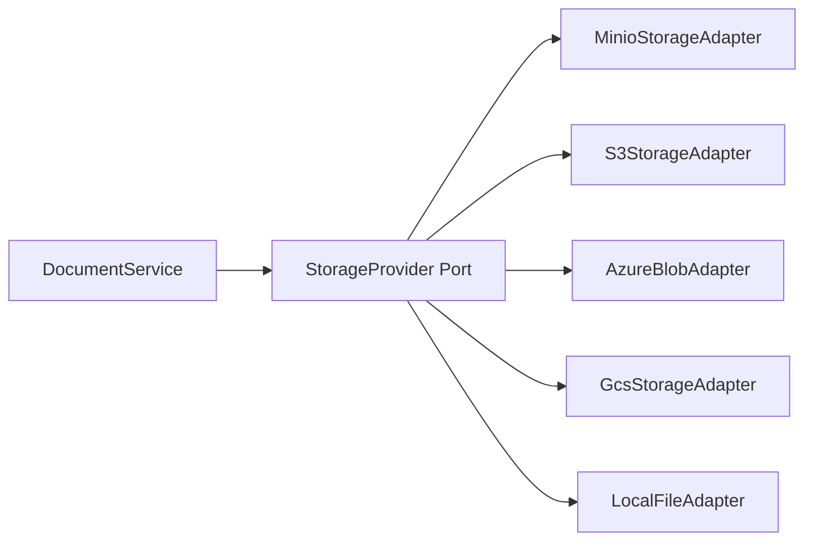
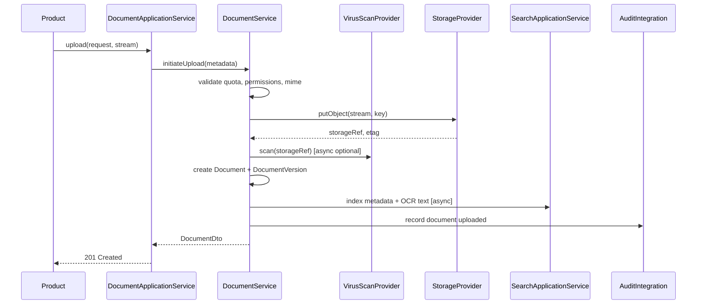
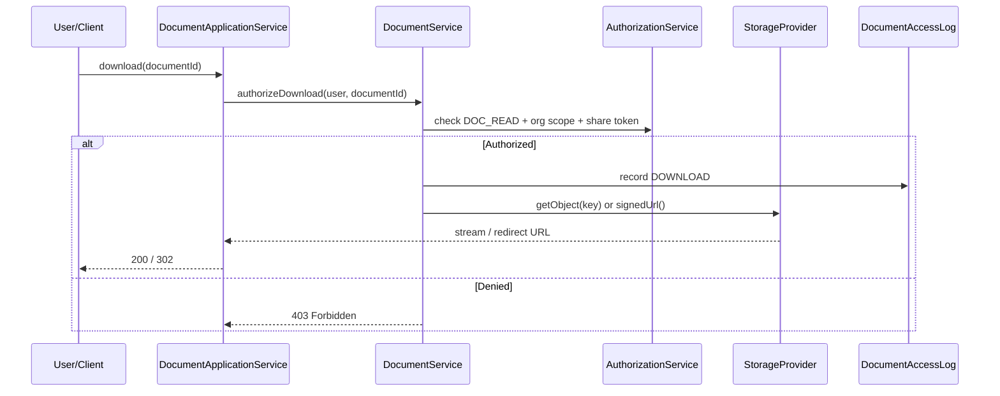
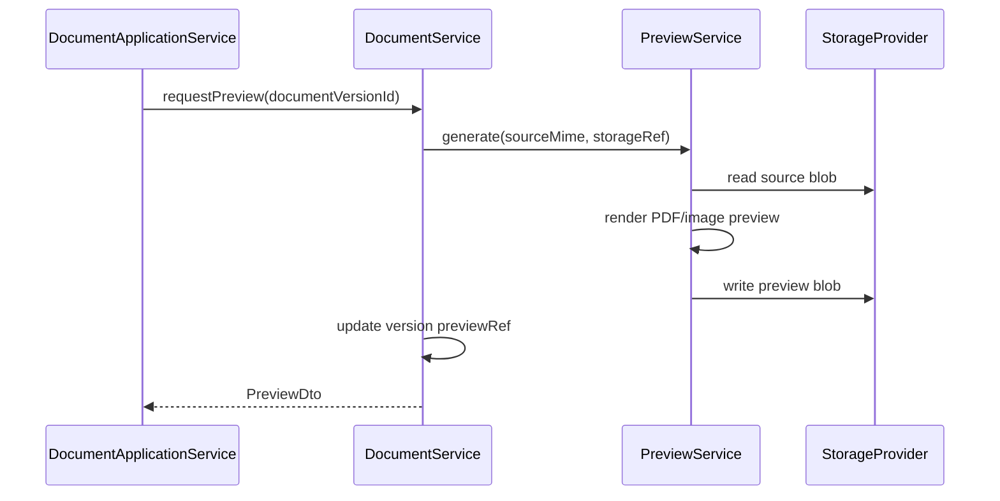
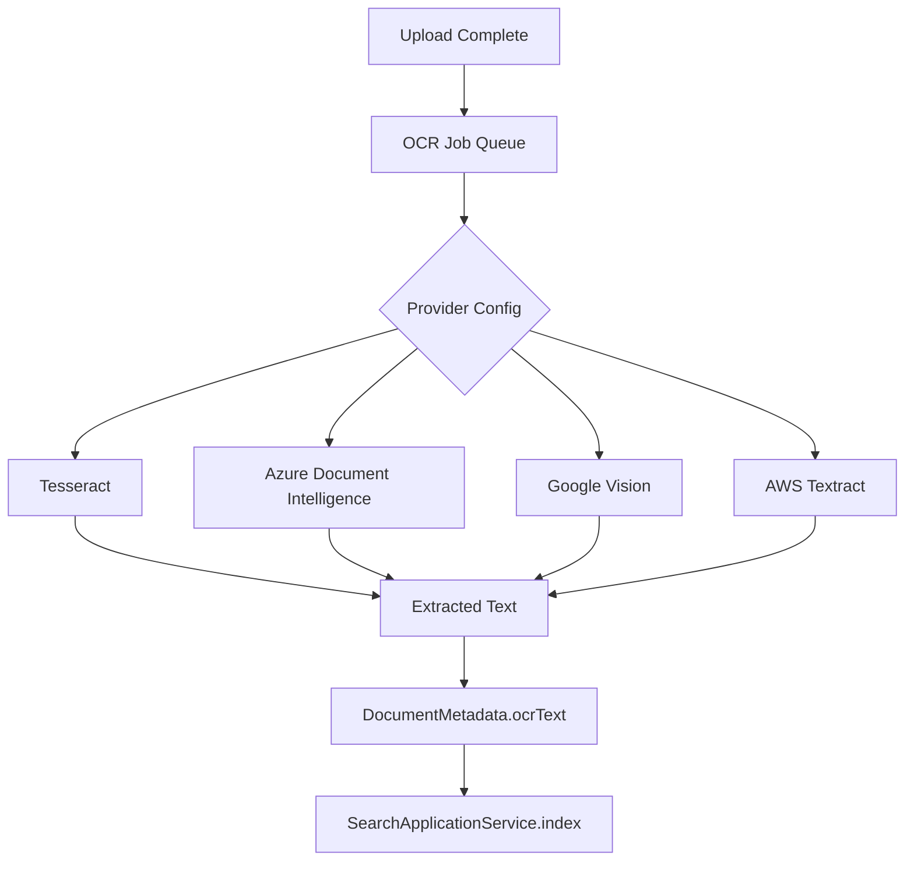
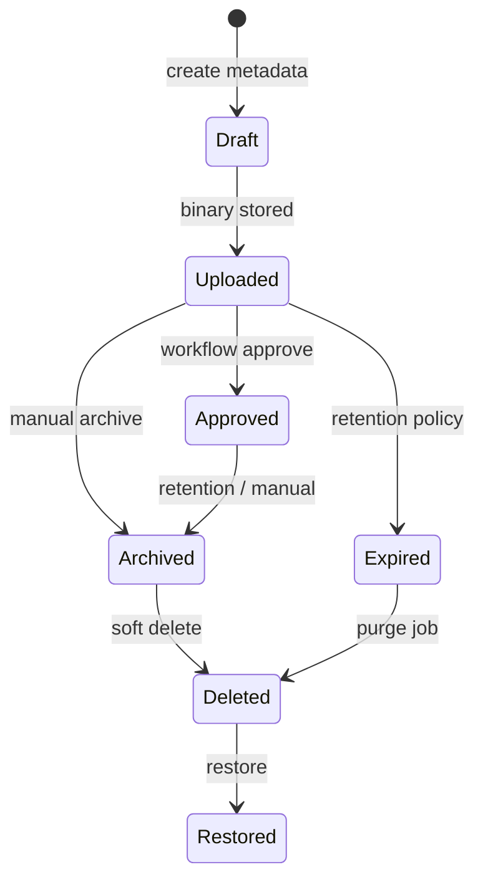

# DOC-001 — Architecture

**Bounded context:** Document Management (DOC)  
**Compliance:** GPS-001, DDD, Hexagonal Architecture, Modular Monolith

---

## 1. System Context

---

## 2. Layering (Hexagonal / Clean)

| Layer | Location | Responsibility |
|-------|----------|----------------|
| **Inbound adapters** | `govos-api` controllers, schedulers | HTTP, cron triggers |
| **Application** | `DocumentApplicationService` | Orchestration, ACL, transactions |
| **Domain** | `com.govos.doc.service` | Business rules, lifecycle |
| **Outbound ports** | `StorageProvider`, `OcrProvider`, `VirusScanProvider` | Abstractions |
| **Outbound adapters** | `storage.minio`, `ocr.tesseract` | Vendor implementations |
| **Persistence** | JPA repositories | PostgreSQL metadata |

**Dependency rule:** Domain never depends on API or vendor SDKs.

---

## 3. Aggregate Relationship Diagram

---

## 4. Storage Abstraction

See [StorageArchitecture.md](./StorageArchitecture.md).

---

## 5. Document Upload Flow

**Rules:**
- Streaming upload — no full buffering of large files in heap
- Checksum computed during stream (SHA-256)
- Chunked/multipart upload for files above configurable threshold

---

## 6. Document Download Flow

---

## 7. Preview Generation Flow

Supported targets: PDF preview for office docs, image resize for images. Async job for large files.

---

## 8. OCR Pipeline

OCR never stores raw images in search index — text extraction only.

---

## 9. Version Lifecycle

See [VersioningStrategy.md](./VersioningStrategy.md).

---

## 10. Cross-Context Communication

| Target | Method | Purpose |
|--------|--------|---------|
| **SRH** | `SearchApplicationService` | Index metadata + OCR text |
| **AUD** | AUD integration API | Immutable audit events |
| **NTF** | Notification API | Share alerts, expiry warnings |
| **WRK** | Workflow API | Approval tasks on upload |
| **IDM** | UUID reference | Owner, creator identity |
| **ORG** | UUID reference | Organization isolation |

**Forbidden:** DOC → OpenSearch direct; products → MinIO/S3 direct.

See [IntegrationArchitecture.md](./IntegrationArchitecture.md).

---

## 11. Modular Monolith Rules

1. Products integrate via `DocumentApplicationService` only
2. Cross-context references are UUID columns (GPS-001)
3. DOC owns all scheduling for retention, OCR backlog, virus rescan
4. Binary blobs never in PostgreSQL — metadata only
5. Provider SDKs isolated in adapter packages

---

## 12. Future Microservice Extraction

DOC is extractable as standalone service when:

- `com.govos.doc` package has no product imports
- Storage and OCR ports remain stable
- REST contract `/api/v1/documents` unchanged
- PostgreSQL `doc_*` schema migrates to dedicated database
