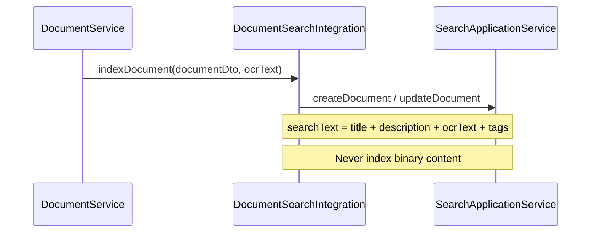
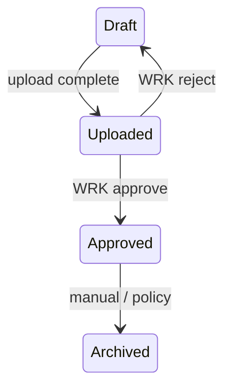
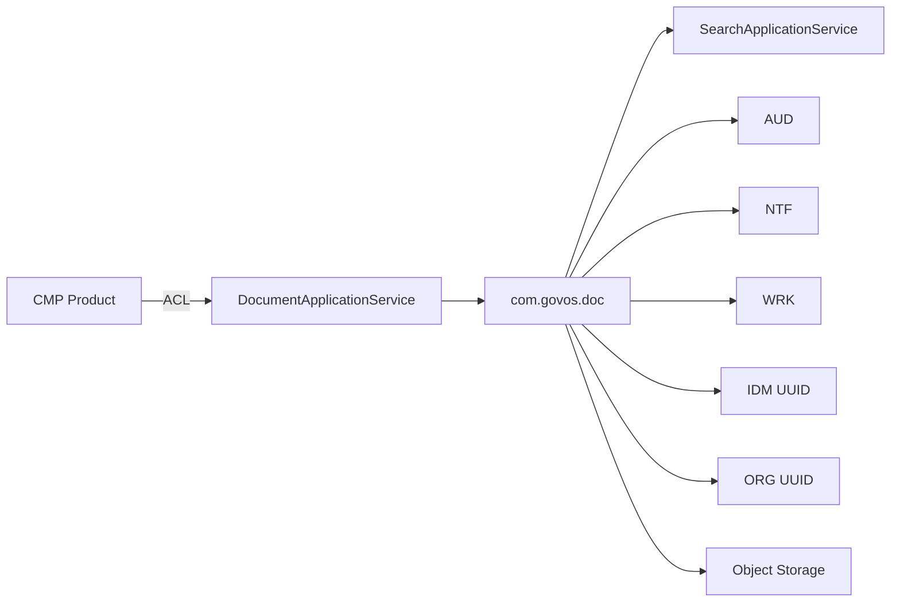

# DOC-001 — Integration Architecture

---

## 1. Integration Principles

1. Products consume DOC via **application service** only
2. DOC consumes platform services via **integration adapters** in `com.govos.doc.integration` or `govos-api` ACL
3. UUID references across contexts — no cross-context FK (GPS-001)
4. Async where appropriate (OCR, preview, search index, notifications)

---

## 2. Product Integration Pattern

```
com.govos.api.{product}.integration.{Product}DocumentIntegrationImpl
    → DocumentApplicationService
```

**Example (future CMP):**
- Complaint attachment upload → DOC upload with `moduleCode=CMP`, `entityType=COMPLAINT`, `referenceId=complaintId`
- Complaint stores `documentId` and optional pinned `documentVersionId` (UUID only)

---

## 3. SRH (Search) Integration

**DOC never talks to OpenSearch directly.**



### Indexed fields (metadata only)

| Field | Source |
|-------|--------|
| `title`, `description` | Document |
| `mimeType`, `category`, `moduleCode` | Document |
| `entityType`, `referenceId` | Business link |
| `ocrText` | DocumentMetadata (extracted) |
| `organizationId` | Tenant |

### Index code

Platform index: `DOC_DOCUMENT` (registered in SRH at DOC-017)

### Delete / archive

- Soft delete → SRH mark removed or delete document sync
- Archive → SRH `active=false` in search payload

---

## 4. AUD (Audit) Integration

| DOC action | AUD event |
|------------|-----------|
| Document uploaded | `DOCUMENT_UPLOADED` |
| Version created | `DOCUMENT_VERSION_CREATED` |
| Downloaded | `DOCUMENT_DOWNLOADED` |
| Shared | `DOCUMENT_SHARED` |
| Deleted | `DOCUMENT_DELETED` |
| Retention purge | `DOCUMENT_PURGED` |

DOC `DocumentAccessLog` = operational detail; AUD = compliance platform trail.

Integration via `AuditIntegration` adapter (same pattern as CMP audit).

---

## 5. NTF (Notifications) Integration

| Trigger | Notification |
|---------|--------------|
| Document shared with user | Email/in-app: "Document shared with you" |
| Retention expiry warning | 30/7/1 day warnings |
| Virus detected | Admin alert |
| OCR completed | Optional webhook to product |
| Signature required | WRK task notification |

Payload: document title, link — never attach binary in email.

---

## 6. WRK (Workflow) Integration

Document lifecycle hooks:

| Status transition | Workflow |
|-------------------|----------|
| `UPLOADED` → `APPROVED` | Approval task in WRK |
| Rejection | Return to `DRAFT` or delete |

WRK calls back via `DocumentApplicationService.approve(documentId)` — not domain service directly.



---

## 7. IDM (Identity) Integration

| Reference | Usage |
|-----------|-------|
| `ownerId` | UUID — document owner |
| `uploadedById` | UUID — version uploader |
| `createdBy` / `updatedBy` | Audit columns (username string + UUID where needed) |

Resolve display names in API layer — DOC stores UUIDs only.

---

## 8. ORG (Organization) Integration

| Reference | Usage |
|-----------|-------|
| `organizationId` | Mandatory on every document |
| Folder scoping | Per organization |
| Retention policies | Org-specific or platform default |

Validate organization exists via ORG service at upload (application layer).

---

## 9. OCR Provider Integration

| Provider | Port adapter | Sprint |
|----------|--------------|--------|
| Tesseract | `TesseractOcrAdapter` | DOC-014 |
| Azure Document Intelligence | `AzureDocumentIntelligenceAdapter` | DOC-014 |
| Google Vision | `GoogleVisionOcrAdapter` | DOC-014 |
| AWS Textract | `TextractOcrAdapter` | DOC-014 |

```java
public interface OcrProviderPort {
    OcrResult extractText(OcrRequest request);
    OcrHealthStatus health();
}
```

---

## 10. Virus Scan Integration

| Provider | Adapter | Sprint |
|----------|---------|--------|
| ClamAV | `ClamAvScanAdapter` | DOC-019 |

```java
public interface VirusScanProviderPort {
    ScanResult scan(StorageRef ref);
}
```

---

## 11. Digital Signature (Future)

```java
public interface SignatureProviderPort {
    SignatureResult sign(SignRequest request);
    VerificationResult verify(VerifyRequest request);
}
```

No implementation in DOC-001 — abstraction only in DOC-016.

---

## 12. Cross-Context Diagram



---

## 13. Domain Events (Future — DOC-008)

Immutable records in `com.govos.doc.event`:

| Event | Consumers (future) |
|-------|---------------------|
| `DocumentUploaded` | SRH index, AUD, NTF |
| `DocumentUpdated` | SRH re-index |
| `DocumentVersionCreated` | SRH, preview job |
| `DocumentDeleted` | SRH remove, AUD |
| `DocumentRestored` | SRH re-index |
| `DocumentShared` | NTF, AUD |
| `DocumentDownloaded` | AUD (optional) |
| `DocumentSigned` | WRK, AUD |
| `PreviewGenerated` | NTF |
| `OcrCompleted` | SRH index update |
| `VirusScanCompleted` | NTF admin, AUD |

Events are contracts in DOC-008; Spring publishing wired in later sprints.

---

## 14. Prohibited Integrations

| Anti-pattern | Owner |
|--------------|-------|
| Product → MinIO/S3 | Must use DOC |
| DOC → OpenSearch | Must use SRH |
| DOC → product repository | Context violation |
| Email with attachment binary | Use signed link via DOC |
