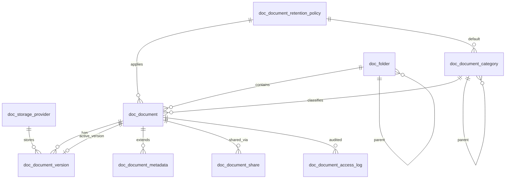

# GovOS Document Management (DOC)

**DOC-012 — Storage Providers** ✅

Document Management bounded context for the GovOS Enterprise Government Platform.

> **Status:** Storage provider infrastructure complete in `govos-domain` (`com.govos.doc.storage`).  
> **Next:** DOC-013 Versioning.  
> **Standards:** [GPS-001](../../docs/platform/README.md) (GovOS Platform Development Standard)

---

## DOC-001 Deliverables

| Document | Purpose |
|----------|---------|
| [Architecture.md](./Architecture.md) | System context, layering, diagrams, flows |
| [AggregateDesign.md](./AggregateDesign.md) | DDD aggregates and relationships |
| [StorageArchitecture.md](./StorageArchitecture.md) | Storage abstraction, providers, streaming |
| [SecurityArchitecture.md](./SecurityArchitecture.md) | Permissions, isolation, signed URLs |
| [VersioningStrategy.md](./VersioningStrategy.md) | Version lifecycle, immutability, rollback |
| [IntegrationArchitecture.md](./IntegrationArchitecture.md) | SRH, AUD, NTF, WRK, IDM, ORG |
| [Roadmap.md](./Roadmap.md) | DOC-001 through DOC-020 milestones |

---

## DOC-002 — Domain Model

### Package layout (implemented)

```
com.govos.doc
├── entity/          9 JPA aggregate roots
├── enums/           10 domain enumerations
└── valueobject/     6 @Embeddable value objects
```

### Aggregate roots

| Entity | Table | Responsibility |
|--------|-------|----------------|
| `Document` | `doc_document` | Identity, lifecycle, active version pointer, org scope |
| `DocumentVersion` | `doc_document_version` | Immutable version blobs, checksum, storage key, pipeline status |
| `Folder` | `doc_folder` | Hierarchical folders with path metadata |
| `DocumentCategory` | `doc_document_category` | Taxonomy and MIME hints |
| `DocumentMetadata` | `doc_document_metadata` | OCR text, custom JSON, extracted metadata |
| `DocumentRetentionPolicy` | `doc_document_retention_policy` | Retention period, legal hold, purge action |
| `DocumentShare` | `doc_document_share` | Share grants, tokens, signed URL metadata |
| `DocumentAccessLog` | `doc_document_access_log` | Append-only access audit records |
| `StorageProvider` | `doc_storage_provider` | Storage backend configuration registry |

### Entity relationships

```
Document ──1:N──► DocumentVersion ──N:1──► StorageProvider
    │                    │
    ├──N:1──► Folder     └── embeds: VersionNumber, DocumentChecksum,
    ├──N:1──► DocumentCategory      StorageLocation, FileSize
    ├──N:1──► DocumentRetentionPolicy
    ├──1:N──► DocumentMetadata
    ├──1:N──► DocumentShare ── embeds: ShareToken
    └──1:N──► DocumentAccessLog

Folder ──N:1──► Folder (parent) ── embeds: DocumentPath
DocumentCategory ──N:1──► DocumentCategory (parent)
DocumentCategory ──N:1──► DocumentRetentionPolicy (default)
```

All cross-context references use **UUID** (`ownerId`, `uploadedById`, `organizationId`) — no JPA `@ManyToOne` to IDM/ORG entities (GPS-001).

### Enum catalog

| Enum | Values |
|------|--------|
| `DocumentStatus` | UPLOADED, PROCESSING, READY, ARCHIVED, DELETED |
| `DocumentClassification` | PUBLIC, INTERNAL, CONFIDENTIAL, RESTRICTED |
| `DocumentVersionStatus` | ACTIVE, ROLLED_BACK, SUPERSEDED |
| `VirusScanStatus` | PENDING, CLEAN, INFECTED, FAILED |
| `OcrStatus` | NOT_STARTED, RUNNING, COMPLETED, FAILED |
| `PreviewStatus` | NOT_GENERATED, GENERATING, READY, FAILED |
| `StorageProviderType` | MINIO, S3, AZURE_BLOB, GOOGLE_CLOUD_STORAGE, LOCAL |
| `RetentionAction` | DELETE, ARCHIVE, LEGAL_HOLD |
| `ShareType` | USER, ROLE, PUBLIC_LINK, SIGNED_URL |
| `AccessOperation` | UPLOAD, DOWNLOAD, PREVIEW, DELETE, SHARE, RESTORE, ROLLBACK |

### Value objects

| Value object | Used by | Purpose |
|--------------|---------|---------|
| `DocumentChecksum` | DocumentVersion | SHA-256 integrity |
| `StorageLocation` | DocumentVersion | Object key, preview/thumbnail keys |
| `FileSize` | DocumentVersion | Positive byte count |
| `VersionNumber` | DocumentVersion | Monotonic version + label |
| `DocumentPath` | Folder | Materialized path metadata |
| `ShareToken` | DocumentShare | Token hash, signed URL expiry, public link |

### Roadmap progress

| Sprint | Status |
|--------|--------|
| DOC-001 Architecture | ✅ Complete |
| DOC-002 Domain Model | ✅ Complete |
| DOC-003 Database Schema | ✅ Complete |
| DOC-004 Repository Layer | ✅ Complete |
| DOC-005 DTO & Mapper | ✅ Complete |
| **DOC-006 Validation** | **✅ Complete** |
| **DOC-007 Domain Services** | **✅ Complete** |
| **DOC-008 Domain Events** | **✅ Complete** |
| **DOC-009 Testing** | **✅ Complete** |
| **DOC-010 Application Layer** | **✅ Complete** |
| **DOC-011 REST API** | **✅ Complete** |
| **DOC-012 Storage Providers** | **✅ Complete** |
| DOC-013 Versioning | 🔜 Next |

---

## DOC-010 — Application Layer

Introduces `DocumentApplicationService` in `com.govos.doc.application` (`govos-api`) as the orchestration boundary between future REST/product integrations and DOC domain services.

### Application architecture

```
Presentation (REST controllers — DOC-011, com.govos.doc.api)
        ↓
Application (DocumentApplicationService)
        ↓
Domain (DocumentService, DocumentVersionService, FolderService, …)
        ↓
Infrastructure (JPA repositories, Flyway — govos-domain / govos-infrastructure)
```

| Layer | Package | Responsibility |
|-------|---------|----------------|
| **Application** | `com.govos.doc.application` | DTO validation, domain delegation, entity→response mapping |
| **Domain** | `com.govos.doc.service` | Business rules, persistence orchestration, domain events |
| **Integration (future)** | `com.govos.doc.application.integration` | Cross-context hooks (SRH, WRK, NTF, AUD, storage, OCR, preview) |

### Call flow

Every write operation follows:

```
Incoming request DTO
    → Validator.validate*(request)
    → DomainService operation
    → Entity result
    → MapStruct mapper.toResponse(entity)
    → Response DTO
```

Read operations delegate to domain services and map entities to response DTOs. **Entities are never exposed** from the application layer.

### Service orchestration

`DocumentApplicationServiceImpl` injects:

- 8 domain services (`DocumentService`, `DocumentVersionService`, `FolderService`, `DocumentCategoryService`, `DocumentMetadataService`, `DocumentRetentionPolicyService`, `DocumentShareService`, `StorageProviderService`)
- 8 MapStruct mappers
- 8 DOC validators
- 7 optional integration port interfaces (`Optional<…>` — no implementations in DOC-010)

**47 application operations** across documents, versions, folders, categories, metadata, retention, shares, and storage providers. No repositories, no business rules, no persistence logic in the application layer.

### Transaction strategy

| Operation type | Annotation |
|----------------|------------|
| Class default | `@Transactional(readOnly = true)` |
| Write (create, update, delete, restore, activate, …) | `@Transactional` on method |

### Future integration points

Placeholder interfaces in `com.govos.doc.application.integration` (interfaces only — not invoked in DOC-010):

| Interface | Future context |
|-----------|----------------|
| `DocumentSearchIntegration` | SRH search indexing |
| `DocumentWorkflowIntegration` | WRK approval flows |
| `DocumentNotificationIntegration` | NTF share/lifecycle alerts |
| `DocumentAuditIntegration` | AUD access and mutation audit |
| `DocumentStorageIntegration` | Object storage adapters |
| `DocumentOcrIntegration` | OCR pipeline |
| `DocumentPreviewIntegration` | Preview generation |

### Out of scope (DOC-010)

No REST controllers, OpenAPI, storage providers, OCR, preview, scheduler, workflow/notification/audit/search implementations, security, or file upload/download.

---

## DOC-011 — REST API Layer

Introduces the HTTP presentation layer for Document Management in `com.govos.doc.api` (`govos-api`). Controllers delegate exclusively to `DocumentApplicationService` from DOC-010 — no repositories, domain services, entities, or business logic in the REST layer.

### Controller architecture

```
HTTP Client
    ↓
@RestController (com.govos.doc.api.*Controller)
    ↓ validate (@Valid / @Validated / PaginationRequest)
    ↓ structured logging (DocumentApiLogging)
    ↓
DocumentApplicationService (DOC-010)
    ↓
Domain services → Response DTOs
    ↓
ApiResponse<T> wrapper + HTTP status
```

| Component | Package | Responsibility |
|-----------|---------|----------------|
| **Controllers** | `com.govos.doc.api` | Request mapping, validation, delegation, response wrapping |
| **Request DTOs** | `com.govos.doc.api.request` | REST-specific payloads (rename, move, classification, activate-version, metadata create, folder move) |
| **Exception handler** | `com.govos.doc.api.advice` | Map DOC domain exceptions → HTTP status + `ErrorResponse` |
| **Logging** | `com.govos.doc.api.support` | Structured `doc_api` logs (requestId, organizationId, resourceId, operation, durationMs) |

### URI structure

Base path: `/api/v1/documents` (`ApiConstants.BASE_PATH + "/documents"`)

| Controller | Base URI |
|------------|----------|
| `DocumentController` | `/api/v1/documents` |
| `DocumentVersionController` | `/api/v1/documents/versions` |
| `FolderController` | `/api/v1/documents/folders` |
| `DocumentCategoryController` | `/api/v1/documents/categories` |
| `DocumentMetadataController` | `/api/v1/documents/metadata` |
| `DocumentRetentionPolicyController` | `/api/v1/documents/retention` |
| `DocumentShareController` | `/api/v1/documents/shares` |
| `StorageProviderController` | `/api/v1/documents/storage-providers` |

### Endpoint catalog (45 endpoints)

**Documents** (`DocumentController`)

| Method | Path | Permission |
|--------|------|------------|
| POST | `/` | DOC_WRITE |
| PUT | `/{documentId}` | DOC_WRITE |
| GET | `/{documentId}` | DOC_READ |
| GET | `/by-number/{documentNumber}` | DOC_READ |
| GET | `/` | DOC_READ |
| GET | `/search` | DOC_READ |
| DELETE | `/{documentId}` | DOC_DELETE |
| POST | `/{documentId}/restore` | DOC_WRITE |
| POST | `/{documentId}/archive` | DOC_WRITE |
| POST | `/{documentId}/rename` | DOC_WRITE |
| POST | `/{documentId}/move` | DOC_WRITE |
| POST | `/{documentId}/classification` | DOC_WRITE |
| POST | `/{documentId}/activate-version` | DOC_WRITE |

**Versions** (`DocumentVersionController`)

| Method | Path | Permission |
|--------|------|------------|
| POST | `/` | DOC_WRITE |
| GET | `/{versionId}` | DOC_READ |
| GET | `/document/{documentId}` | DOC_READ |
| POST | `/{versionId}/activate` | DOC_WRITE |

**Folders** (`FolderController`)

| Method | Path | Permission |
|--------|------|------------|
| POST | `/` | DOC_WRITE |
| PUT | `/{folderId}` | DOC_WRITE |
| GET | `/{folderId}` | DOC_READ |
| DELETE | `/{folderId}` | DOC_DELETE |
| POST | `/{folderId}/restore` | DOC_WRITE |
| POST | `/{folderId}/move` | DOC_WRITE |

**Categories** (`DocumentCategoryController`)

| Method | Path | Permission |
|--------|------|------------|
| POST | `/` | DOC_WRITE |
| PUT | `/{categoryId}` | DOC_WRITE |
| DELETE | `/{categoryId}` | DOC_DELETE |
| POST | `/{categoryId}/restore` | DOC_WRITE |

**Metadata** (`DocumentMetadataController`)

| Method | Path | Permission |
|--------|------|------------|
| POST | `/` | DOC_WRITE |
| PUT | `/{metadataId}` | DOC_WRITE |
| GET | `/document/{documentId}` | DOC_READ |

**Retention** (`DocumentRetentionPolicyController`)

| Method | Path | Permission |
|--------|------|------------|
| POST | `/` | DOC_ADMIN |
| PUT | `/{policyId}` | DOC_ADMIN |
| GET | `/{policyId}` | DOC_READ |
| DELETE | `/{policyId}` | DOC_ADMIN |
| POST | `/{policyId}/restore` | DOC_ADMIN |

**Shares** (`DocumentShareController`)

| Method | Path | Permission |
|--------|------|------------|
| POST | `/` | DOC_SHARE |
| GET | `/{shareId}` | DOC_SHARE |
| POST | `/{shareId}/expire` | DOC_SHARE |
| POST | `/{shareId}/revoke` | DOC_SHARE |

**Storage providers** (`StorageProviderController`)

| Method | Path | Permission |
|--------|------|------------|
| POST | `/` | DOC_ADMIN |
| PUT | `/{providerId}` | DOC_ADMIN |
| GET | `/{providerId}` | DOC_ADMIN |
| POST | `/{providerId}/activate` | DOC_ADMIN |
| POST | `/{providerId}/deactivate` | DOC_ADMIN |
| POST | `/{providerId}/default` | DOC_ADMIN |

### Pagination

List and search endpoints accept `page`, `size`, and `sort` via `PaginationRequest` + `SortParser`, building a Spring `Pageable` and returning existing paginated DTOs (`DocumentListResponse`, `DocumentSearchResponse`, etc.).

### OpenAPI

All controllers annotated with:

- `@Tag` — controller group name and description
- `@Operation` — summary, description, required permission
- `@ApiResponses` / `@ApiResponse` — 200/201/204/400/404/409 response codes
- `@Parameter` — path and query parameter documentation
- `@SecurityRequirement(name = "bearerAuth")` — JWT bearer scheme

Swagger UI exposes the full DOC API catalog when `govos-api` is running.

### Security annotations

Method-level `@PreAuthorize("hasAuthority('DOC_*')")` on every endpoint:

| Permission | Usage |
|------------|-------|
| `DOC_READ` | Get, list, search |
| `DOC_WRITE` | Create, update, restore, lifecycle mutations |
| `DOC_DELETE` | Soft-delete documents, folders, categories |
| `DOC_SHARE` | Share create, read, expire, revoke |
| `DOC_ADMIN` | Retention policies, storage provider registry |

Security configuration (filter chain, permission seeding) is **not** implemented in DOC-011 — annotations only. `DOC_MONITOR` is reserved for future observability endpoints (DOC-019).

### Exception handling

`DocumentRestExceptionHandler` (`@RestControllerAdvice(basePackages = "com.govos.doc.api")`):

| Exception | HTTP | Code |
|-----------|------|------|
| `*NotFoundException` (document, folder, category, version, metadata, retention, share, storage) | 404 | `NOT_FOUND` |
| `DocumentValidationException` (duplicate codes) | 409 | `CONFLICT` |
| `DocumentValidationException` (other) | 422 | `DOCUMENT_VALIDATION_ERROR` |
| `DocException` (fallback) | 422 | `DOCUMENT_ERROR` |

Existing DOC exception hierarchy is unchanged.

### Structured logging

`DocumentApiLogging` emits INFO-level structured logs per operation:

```
doc_api requestId=… operation=… organizationId=… resourceId=… durationMs=…
```

Never logs document content, OCR text, storage keys, tokens, or credentials.

### Controller tests

MockMvc standalone tests in `govos-api/src/test/java/com/govos/doc/api/`:

| Test class | Coverage |
|------------|----------|
| `DocumentControllerTest` | Create, find, delete, pagination, validation failure (422), not found (404), conflict (409) |
| `DocumentRestExceptionHandlerTest` | Exception → HTTP status mapping |
| `DocumentApiSecurityTest` | `@PreAuthorize` presence and permission values |

Only `DocumentApplicationService` is mocked — no integration tests, no Spring context.

### Out of scope (DOC-011)

No multipart upload/download, object storage adapters, OCR, preview/thumbnail generation, search indexing, workflow/notification integration, scheduler, audit adapters, or production security configuration.

---

## DOC-012 — Storage Providers

Introduces production-ready object storage infrastructure in `com.govos.doc.storage` (`govos-domain`). Products and controllers never access object storage directly — all blob I/O flows through `DocumentStorageService` → `StorageProviderPort`.

### Provider architecture

```
DocumentApplicationService (future upload/download orchestration)
        ↓
DocumentStorageService
        ↓
StorageProviderFactory (configuration-driven)
        ↓
StorageProviderPort
        ↓
Local | MinIO | S3 | Azure Blob | Google Cloud Storage
```

| Package | Responsibility |
|---------|----------------|
| `com.govos.doc.storage.port` | `StorageProviderPort`, object refs, metadata, multipart session types |
| `com.govos.doc.storage.service` | `DocumentStorageService` — provider selection, validation, delegation |
| `com.govos.doc.storage.factory` | `StorageProviderFactory` — resolves `local\|minio\|s3\|azure\|gcs` |
| `com.govos.doc.storage.provider.*` | Provider implementations + SDK client adapters |
| `com.govos.doc.storage.config` | `DocumentStorageProperties`, Spring `@Configuration` beans |
| `com.govos.doc.storage.metrics` | Micrometer counters (`storage.uploads`, `storage.downloads`, …) |
| `com.govos.doc.storage.health` | `StorageHealthIndicator` — UP/DOWN/DEGRADED/UNKNOWN |
| `com.govos.doc.storage.support` | Buffered streaming, storage key hashing for logs |

### StorageProviderPort operations

`store`, `load`, `delete`, `exists`, `copy`, `move`, `generateSignedDownloadUrl`, `generateSignedUploadUrl`, `getMetadata`, `listObjects`, `health`, multipart (`beginMultipartUpload`, `uploadPart`, `completeMultipartUpload`, `abortMultipartUpload`).

### Configuration

Prefix: `govos.document.storage` (see `application.yml`)

| Property | Default | Description |
|----------|---------|-------------|
| `provider` | `local` | Active provider: `local`, `minio`, `s3`, `azure`, `gcs` |
| `bucket` | `govos-documents` | Default bucket/container |
| `max-file-size` | 5 GB | Upload size limit enforced by `DocumentStorageService` |
| `multipart-threshold` | 10 MB | Multipart threshold (provider-internal) |
| `signed-url-expiration` | 300 s | Default signed URL TTL |
| `buffer-size` | 8192 | Stream copy buffer size |

Provider-specific blocks: `local`, `minio`, `s3`, `azure`, `google` with environment variable overrides (`GOVOS_DOCUMENT_*`).

### Streaming

All providers use `InputStream` / `OutputStream` with configurable buffer sizes via `StorageStreamSupport` — large files are never fully loaded into memory.

### Multipart upload

Multipart session abstraction exposed on `StorageProviderPort`. `LocalStorageProvider` implements full multipart (temp parts + merge). Cloud providers expose simplified multipart skeletons ready for production SDK integration.

### Signed URLs

Download and upload signed URLs with configurable expiration. Local provider returns internal `local://` URLs for development.

### Health

Each provider implements `health()` returning `StorageHealth` with status `UP`, `DOWN`, `DEGRADED`, or `UNKNOWN`. `StorageHealthIndicator` integrates with future DOC monitoring.

### Metrics

`StorageMetricsRecorder` emits Micrometer counters (when registry available):

- `storage.uploads`, `storage.downloads`, `storage.deletes`, `storage.copies`, `storage.moves`, `storage.failures`
- `storage.bytes.uploaded`, `storage.bytes.downloaded`

Tagged by `provider`. Existing platform metrics unchanged.

### Tests

Unit tests in `src/test/java/com/govos/doc/storage/`:

| Test class | Coverage |
|------------|----------|
| `StorageProviderFactoryTest` | Configuration-driven provider resolution |
| `DocumentStorageServiceTest` | Delegation, max file size, signed URL TTL |
| `LocalStorageProviderTest` | Store/load, health, signed URLs, multipart lifecycle |
| `MinioStorageProviderTest` | Mock client delegation, degraded health |
| `S3StorageProviderTest` | Mock client delegation, degraded health |
| `AzureBlobStorageProviderTest` | Mock client delegation, degraded health |
| `GoogleCloudStorageProviderTest` | Mock client delegation, degraded health |
| `DocumentStoragePropertiesTest` | Configuration defaults |
| `StorageHealthIndicatorTest` | Health status exposure |
| `StorageStreamSupportTest` | Buffered copy, key hashing |

All external SDKs mocked — no network access.

### Out of scope (DOC-012)

No REST multipart upload/download endpoints, OCR, preview/thumbnail generation, digital signatures, search indexing, workflow/notification integration, retention scheduler, or virus scanning.

---

## DOC-009 — Testing

Pure unit tests for the DOC-002 through DOC-008 layers. No Spring context, no database, no REST, no storage, no OCR, no HTTP.

### Test architecture

| Layer | Approach |
|-------|----------|
| **Entity** | Direct instantiation; verify getters/setters, embedded value objects, relationships, soft-delete and version fields |
| **Value object** | Creation, validation, `equals`/`hashCode`, boundary conditions |
| **Validator** | Jakarta `Validator` injected via constructor; assert valid/invalid paths and exception messages |
| **Service** | `@ExtendWith(MockitoExtension.class)`; mock repositories, validators, mappers, `DocumentEventPublisher`; assert business rules, events, not-found, duplicates |
| **Mapper** | Real MapStruct `*MapperImpl`; entity ↔ DTO mapping, update semantics, collection helpers, null handling |
| **Event** | `DocumentEvents` factory payloads; `NoOpDocumentEventPublisher` no-op behavior |

Tests live under `src/test/java/com/govos/doc` in packages mirroring production code.

### Fixture strategy

`com.govos.doc.support.DocumentTestFixtures` provides reusable builders and constants for all nine aggregate roots, create/update DTOs, and shared IDs (`ORG_ID`, `DOCUMENT_ID`, valid SHA-256 checksum).

### Mockito usage

- `@ExtendWith(MockitoExtension.class)` on service tests
- `@Mock` for repositories, validators, mappers, and `DocumentEventPublisher`
- `@InjectMocks` for `*ServiceImpl` under test
- No `@SpringBootTest`, no MockMvc, no Testcontainers, no database

### JaCoCo gates

Enforced at `mvn -pl govos-domain verify`:

| Scope | Minimum line coverage |
|-------|----------------------|
| `com.govos.doc.service.impl` | 90% |
| `com.govos.doc.validator` | 90% |
| `com.govos.doc.mapper` | 90% |
| `com.govos.doc.event` + `com.govos.doc.event.publisher` | 90% |
| Per-class (service, validator, mapper impl, events) | 85% |

### Test inventory

| Package | Test classes |
|---------|--------------|
| `com.govos.doc.entity` | `DocumentTest`, `DocumentVersionTest`, `FolderTest`, `DocumentCategoryTest`, `DocumentMetadataTest`, `DocumentRetentionPolicyTest`, `DocumentShareTest`, `DocumentAccessLogTest`, `StorageProviderTest` |
| `com.govos.doc.valueobject` | `DocumentChecksumTest`, `StorageLocationTest`, `FileSizeTest`, `VersionNumberTest`, `DocumentPathTest`, `ShareTokenTest` |
| `com.govos.doc.validator` | `DocumentValidatorTest`, `DocumentVersionValidatorTest`, `FolderValidatorTest`, `DocumentCategoryValidatorTest`, `DocumentMetadataValidatorTest`, `DocumentRetentionPolicyValidatorTest`, `DocumentShareValidatorTest`, `StorageProviderValidatorTest`, `ValidationUtilsTest` |
| `com.govos.doc.service.impl` | `DocumentServiceImplTest`, `DocumentVersionServiceImplTest`, `FolderServiceImplTest`, `DocumentCategoryServiceImplTest`, `DocumentMetadataServiceImplTest`, `DocumentRetentionPolicyServiceImplTest`, `DocumentShareServiceImplTest`, `StorageProviderServiceImplTest` |
| `com.govos.doc.mapper` | `DocumentMapperTest`, `DocumentVersionMapperTest`, `FolderMapperTest`, `DocumentCategoryMapperTest`, `DocumentMetadataMapperTest`, `DocumentRetentionPolicyMapperTest`, `DocumentShareMapperTest`, `DocumentAccessLogMapperTest`, `StorageProviderMapperTest` |
| `com.govos.doc.event` | `DocumentEventsTest`, `NoOpDocumentEventPublisherTest` |
| `com.govos.doc.support` | `DocumentTestFixtures` |

**240** test methods under `com.govos.doc.**`.

### Out of scope (DOC-009)

No application services, REST APIs, MockMvc, integration tests, storage providers, OCR, preview, scheduler, search/workflow/notification/audit integration, or production feature changes.

---

## DOC-008 — Domain Events

### Packages

```
com.govos.doc.event              — DocumentDomainEvent contract + 34 immutable event records
com.govos.doc.event.publisher    — DocumentEventPublisher abstraction + NoOpDocumentEventPublisher
```

### Event contract

All events implement `DocumentDomainEvent` with common fields:

| Field | Purpose |
|-------|---------|
| `eventId` | Unique event instance identifier (UUID) |
| `eventType` | Canonical type string (see `DocumentEventTypes`) |
| `occurredAt` | Timestamp when the business operation completed |
| `organizationId` | Org scope (nullable for platform-level events) |
| `documentId` | Document aggregate reference (nullable when not applicable) |
| `userId` | Acting user / owner reference (nullable when unknown) |
| `correlationId` | Cross-service trace hook (reserved for application layer) |
| `version` | Aggregate optimistic-lock version at time of event |

### Event catalog (34 records)

| Domain | Events |
|--------|--------|
| Document | Created, Updated, Deleted, Restored, Archived, Moved, Renamed, ClassificationChanged, ActiveVersionChanged |
| Version | VersionCreated, VersionActivated |
| Folder | Created, Updated, Moved, Deleted, Restored |
| Category | Created, Updated, Deleted, Restored |
| Metadata | Created, Updated |
| Retention | PolicyCreated, PolicyUpdated, PolicyDeleted, PolicyRestored |
| Share | Shared, ShareExpired, ShareRevoked |
| Storage | ProviderCreated, ProviderUpdated, ProviderActivated, ProviderDeactivated, ProviderDefaultChanged |

Events are **immutable Java records**. Payloads contain identifiers and business metadata only — no JPA entities, binary content, storage credentials, or OCR text.

### Publisher abstraction

```java
public interface DocumentEventPublisher {
    void publish(DocumentDomainEvent event);
    void publishAll(Collection<DocumentDomainEvent> events);
}
```

| Implementation | Purpose |
|----------------|---------|
| `NoOpDocumentEventPublisher` | Default `@Primary` `@Component` — safely ignores events until infrastructure adapters are wired |

Domain services inject `DocumentEventPublisher` only — **no direct `ApplicationEventPublisher`**, no Kafka/RabbitMQ.

### Publishing flow

```
Domain Service (DOC-007)
    → validate → persist → DocumentEvents.* factory → eventPublisher.publish(event)
        → NoOpDocumentEventPublisher (DOC-008)
            → (future) Spring / AUD / SRH / NTF / WRK adapters
```

`DocumentEvents` factory builds events from saved entity state after successful repository writes.

### Service integration

All 8 DOC-007 service implementations publish events post-commit within the same `@Transactional` method, after `repository.save` succeeds. Read operations do not publish events.

### Future consumers (documentation only)

| Consumer | Intended use |
|----------|--------------|
| **AUD** | Audit trail enrichment from document lifecycle events |
| **SRH** | Search index updates on create/update/delete/archive and metadata changes |
| **NTF** | Share notifications, expiry alerts, retention warnings |
| **WRK** | Workflow triggers on document status and approval transitions |
| **Scheduler** | Retention expiry jobs, share expiry sweeps, purge orchestration |

No consumer implementations in DOC-008.

### Out of scope (DOC-008)

No Spring event listeners, messaging infrastructure, application services, REST, storage, OCR, preview, scheduler, search, audit, workflow, notification integration, or tests.

---

## DOC-007 — Domain Services

### Packages

```
com.govos.doc.service         — 8 service interfaces
com.govos.doc.service.impl    — 8 @Service implementations
com.govos.doc.exception       — Not-found exceptions (extends DocException)
```

### Service catalog

| Service | Operations | Business rules enforced |
|---------|------------|-------------------------|
| `DocumentService` | create, update, delete, restore, archive, changeClassification, move, rename, activateVersion, findById, findByDocumentNumber, findByOrganization | Unique document number per org, org-scoped folder/category/retention assignment, status transitions, soft delete, active version pointer |
| `DocumentVersionService` | createVersion, activateVersion, getLatestVersion, findVersion, listVersions | Sequential version numbers, immutable versions, supersede on activate, unique storage key, active provider validation |
| `FolderService` | create, rename, move, delete, restore, find | Hierarchy depth, duplicate sibling names, materialized path, org isolation, non-empty delete guard |
| `DocumentCategoryService` | create, update, delete, restore | Unique code per org, parent hierarchy, org scope |
| `DocumentMetadataService` | create, update, replace, find | Single metadata per version scope, OCR/attribute replacement |
| `DocumentRetentionPolicyService` | create, update, delete, restore, find | Unique policy name per org, retention days, legal hold delete guard |
| `DocumentShareService` | create, expire, revoke, find | Share type rules, expiry, duplicate share prevention |
| `StorageProviderService` | create, update, activate, deactivate, setDefault, find | Unique provider name, only one default, active provider validation |

### Repository usage

Services inject DOC-004 repositories only — no direct SQL, no cross-context joins. All reads use `findByIdAndDeletedFalse` (or org-scoped variants). Relation objects (`folder`, `category`, `document`, `storageProvider`) are resolved in services from UUID foreign keys in request DTOs.

### Validator integration

Every write path calls the matching DOC-006 validator before persistence. Additional repository-backed rules (uniqueness, org scope, version sequencing) raise `DocumentValidationException` via `ValidationResult.throwIfInvalid()`.

### Transaction boundaries

| Operation type | Annotation |
|----------------|------------|
| Write (create, update, delete, restore, activate, …) | `@Transactional` on method |
| Read (find, list, getLatest) | Class-level `@Transactional(readOnly = true)`; write methods override |

### Exception hierarchy

```
DocException
├── DocumentValidationException     — validation / business rule failures
├── DocumentNotFoundException
├── FolderNotFoundException
├── CategoryNotFoundException
├── VersionNotFoundException
├── MetadataNotFoundException
├── RetentionPolicyNotFoundException
├── ShareNotFoundException
└── StorageProviderNotFoundException
```

Not-found exceptions are thrown when an active (non-deleted) entity cannot be loaded. Validation failures always use `DocumentValidationException`.

### Domain service flow

```
Caller (DOC-010+ application layer)
    → Service interface
        → Validator.validate*(request)
        → Repository-backed business rules
        → Mapper.toEntity / updateEntity (request → entity fields only)
        → Resolve relations by UUID
        → Repository.save
        → Return entity (no response DTO mapping in domain layer)
```

### Out of scope (DOC-007)

No application services, REST controllers, response DTO mapping, storage adapters, OCR, preview, scheduler, events, search, audit, workflow, or notification integration.

---

## DOC-006 — Validation Layer

### Packages

```
com.govos.doc.validator    — 8 @Component validators + ValidationUtils
com.govos.doc.exception    — DocException, DocumentValidationException, ValidationError, ValidationResult
```

### Validators

| Validator | Key methods | Responsibilities |
|-----------|-------------|------------------|
| `DocumentValidator` | validateCreate, validateUpdate, validateDelete, validateRestore, validateStatusTransition | Title, org, owner, document number, classification, basic status transitions |
| `DocumentVersionValidator` | validateCreate, validateVersion, validateUpdate | Checksum, storage key, size, MIME, filename, pipeline statuses |
| `FolderValidator` | validateCreate, validateUpdate, validateDelete | Org, name, path length, depth, parent self-reference |
| `DocumentCategoryValidator` | validateCreate, validateUpdate | Code, name, parent self-reference |
| `DocumentMetadataValidator` | validateDocumentScope, validateUpdate | Document/version scope, OCR and JSON size limits |
| `DocumentRetentionPolicyValidator` | validateCreate, validateUpdate | Policy name, retention days, expiry action, legal hold |
| `DocumentShareValidator` | validateShare, validateCreate | Share type rules, recipient, expiry |
| `StorageProviderValidator` | validateCreate, validateUpdate | Provider name/type, bucket, default provider rules |

Validators are **stateless field validators** — no repository access, no entity loading, no external system calls.

### Exception hierarchy

```
DocException
└── DocumentValidationException
        └── wraps ValidationResult
                └── List<ValidationError> (field, message, code)
```

`ValidationResult.throwIfInvalid()` raises `DocumentValidationException` with aggregated field errors.

### Validation flow

```
Application Service (DOC-010+)
    → Validator.validateCreate(request)
        → ValidationUtils + domain rules → ValidationResult
            → throwIfInvalid() → DocumentValidationException
    → Mapper.toEntity(request)
    → Repository.save (DOC-007+)
```

### Jakarta Validation integration

- Injected `jakarta.validation.Validator` in each validator
- `ValidationUtils.validateBean()` merges Bean Validation constraint violations into `ValidationResult`
- Imperative rules (SHA-256 format, MIME pattern, share type rules, status transitions) in validator methods

---

## DOC-005 — DTO & Mapper Layer

### DTO organization

```
com.govos.doc.dto
├── document/     Create/Update/Response/Summary/Search/List/Reference DTOs
├── version/      Version create/update/response/summary DTOs
├── folder/       Folder CRUD and tree DTOs
├── category/     Category CRUD DTOs
├── metadata/     Metadata response and update DTOs
├── retention/    Retention policy CRUD DTOs
├── share/        Share create/response/link DTOs
├── audit/        Access log response DTO
└── storage/      Storage provider CRUD DTOs
```

All DTOs are **Java records**. Requests exclude `id`, audit fields, and `deleted`. Responses expose UUIDs, enums, and business fields only — no JPA entities or lazy collections.

### Mapper interfaces

| Mapper | Entity | Operations |
|--------|--------|------------|
| `DocumentMapper` | Document | toResponse, toSummary, toSearch, toReference, toListResponse(Page), toEntity, updateEntity |
| `DocumentVersionMapper` | DocumentVersion | toResponse, toSummary, lists, toEntity, updateEntity |
| `FolderMapper` | Folder | toResponse, toTreeResponse, toEntity, updateEntity |
| `DocumentCategoryMapper` | DocumentCategory | toResponse, toEntity, updateEntity |
| `DocumentMetadataMapper` | DocumentMetadata | toResponse, updateEntity |
| `DocumentRetentionPolicyMapper` | DocumentRetentionPolicy | toResponse, toEntity, updateEntity |
| `DocumentShareMapper` | DocumentShare | toResponse, toLinkResponse, toEntity |
| `DocumentAccessLogMapper` | DocumentAccessLog | toResponse (read-only) |
| `StorageProviderMapper` | StorageProvider | toResponse, toEntity, updateEntity |

### MapStruct conventions

- `@Mapper(componentModel = "spring", unmappedTargetPolicy = ReportingPolicy.IGNORE)`
- `@BeanMapping(nullValuePropertyMappingStrategy = IGNORE)` on all update methods
- Audit fields (`createdBy`, `createdDate`, `updatedBy`, `updatedDate`, `deleted`) ignored on create/update
- Relation objects ignored on create/update — resolved by services in DOC-007
- Embedded value objects flattened via nested `@Mapping` paths

### Collection mapping

- `List<T>` mapping methods on all response mappers
- `DocumentMapper.toListResponse(Page<Document>)` wraps paginated summaries
- `DocumentVersionMapper.toSummaryResponsePage(Page<DocumentVersion>)` for version listings

---

## DOC-004 — Repository Layer

### Package

```
com.govos.doc.repository   — 9 Spring Data JPA interfaces
```

### Repositories

| Repository | Entity | Key query patterns |
|------------|--------|-------------------|
| `DocumentRepository` | Document | Org scope, status, folder, category, document number, title search |
| `DocumentVersionRepository` | DocumentVersion | By document, checksum, storage key, version status |
| `FolderRepository` | Folder | Org, parent, materialized path |
| `DocumentCategoryRepository` | DocumentCategory | Org, code, parent category |
| `DocumentMetadataRepository` | DocumentMetadata | By document, by version |
| `DocumentRetentionPolicyRepository` | DocumentRetentionPolicy | Org, policy name (`name` column) |
| `DocumentShareRepository` | DocumentShare | Document, recipient, token hash, expiry |
| `DocumentAccessLogRepository` | DocumentAccessLog | Document, user, operation, time range |
| `StorageProviderRepository` | StorageProvider | Name, type, active, default |

### Query strategy

- **Derived queries** for all standard lookups — no business logic in repositories
- **Soft delete:** every query method suffix `AndDeletedFalse` excludes tombstoned rows
- **Embedded value objects:** nested paths (e.g. `StorageLocation_StorageObjectKey`, `VersionNumber_Value`)
- **Cross-context refs:** query by UUID columns (`ownerId`, `sharedWithUserId`) — no joins to IDM/ORG
- **No JPQL/native SQL** in this sprint — derived queries only
- **No `JpaSpecificationExecutor`** — not used elsewhere in GovOS platform modules

### Pagination and sorting

`Pageable` supported on:

- `DocumentRepository` — org listing, status filter, owner, title search, all active documents
- `DocumentVersionRepository` — versions per document

Sorting delegated to Spring Data `Sort` via `Pageable`; no custom sort logic.

### Soft delete approach

Repositories never filter `deleted = true` in default methods. Services (DOC-007+) must use `findByIdAndDeletedFalse` and related methods. Physical delete not exposed at repository layer.

---

## DOC-003 — Database Schema

### Flyway migration

| Field | Value |
|-------|-------|
| **File** | `govos-infrastructure/src/main/resources/db/migration/V2_2_0__document_management.sql` |
| **Version** | V2.2.0 |
| **Action** | Drops legacy V1_4_0 Sprint 0 tables; creates GPS-001-compliant DOC-002 schema |

### Tables

| Table | Purpose |
|-------|---------|
| `doc_storage_provider` | Object storage backend registry |
| `doc_document_retention_policy` | Retention rules and legal hold |
| `doc_folder` | Hierarchical folder tree |
| `doc_document_category` | Document taxonomy |
| `doc_document` | Document identity and lifecycle |
| `doc_document_version` | Immutable version blobs |
| `doc_document_metadata` | OCR text, JSONB metadata |
| `doc_document_share` | Sharing grants and tokens |
| `doc_document_access_log` | Append-only access audit |

### ER diagram



### Audit columns (GPS-001)

All tables include: `id` (UUID PK), `code`, `active`, `deleted`, `version`, `created_by` (VARCHAR), `created_date` (TIMESTAMPTZ), `updated_by`, `updated_date`.

> DOC-003 sprint brief references UUID audit columns; GPS-001 §06 uses VARCHAR username audit fields mapped by `AuditableEntity`.

### Foreign keys (within DOC only)

| FK | From | To |
|----|------|-----|
| `fk_doc_folder_parent` | `doc_folder.parent_folder_id` | `doc_folder.id` |
| `fk_doc_category_parent` | `doc_document_category.parent_category_id` | `doc_document_category.id` |
| `fk_doc_category_default_retention` | `doc_document_category.default_retention_policy_id` | `doc_document_retention_policy.id` |
| `fk_doc_document_folder` | `doc_document.folder_id` | `doc_folder.id` |
| `fk_doc_document_category` | `doc_document.category_id` | `doc_document_category.id` |
| `fk_doc_document_retention_policy` | `doc_document.retention_policy_id` | `doc_document_retention_policy.id` |
| `fk_doc_document_active_version` | `doc_document.active_version_id` | `doc_document_version.id` |
| `fk_doc_document_version_document` | `doc_document_version.document_id` | `doc_document.id` |
| `fk_doc_document_version_storage_provider` | `doc_document_version.storage_provider_id` | `doc_storage_provider.id` |
| `fk_doc_document_metadata_document` | `doc_document_metadata.document_id` | `doc_document.id` |
| `fk_doc_document_metadata_version` | `doc_document_metadata.document_version_id` | `doc_document_version.id` |
| `fk_doc_document_share_document` | `doc_document_share.document_id` | `doc_document.id` |
| `fk_doc_document_access_log_document` | `doc_document_access_log.document_id` | `doc_document.id` |

No FK to `idm_user`, `org_organization`, or any cross-context table.

### Unique constraints

| Index | Columns |
|-------|---------|
| `uk_doc_storage_provider_name_active` | `provider_name` |
| `uk_doc_document_category_org_code_active` | `organization_id`, `code` |
| `uk_doc_document_org_document_number_active` | `organization_id`, `document_number` |
| `uk_doc_document_version_storage_object_key_active` | `storage_object_key` |
| `uk_doc_document_version_doc_number_active` | `document_id`, `version_number` |
| `uk_doc_document_share_token_hash_active` | `token_hash` |
| `uk_doc_retention_policy_org_name_active` | `organization_id`, `name` |

### Check constraints

| Constraint | Rule |
|------------|------|
| `ck_doc_document_version_size` | `size_bytes > 0` |
| `ck_doc_retention_policy_days` | `retention_days >= 0` |
| Enum CHECK constraints | Status, classification, scan/OCR/preview/share types |

### Key indexes

- Single-column: `organization_id`, `status`, `folder_id`, `category_id`, `owner_id`, `checksum`, `storage_object_key`, `accessed_at`
- Composite: `(organization_id, status)`, `(organization_id, created_date)`, `(document_id, version_number)`
- GIN: `metadata_json`, OCR full-text placeholder (`to_tsvector` on `ocr_text`)

### UUID strategy

- Primary keys: `UUID DEFAULT gen_random_uuid()` — no sequences
- Cross-context refs: `owner_id`, `uploaded_by_id`, `user_id`, `organization_id` as plain UUID columns

---

## 1. Purpose

DOC is the **single platform service** responsible for every document stored in GovOS. No product module (CMP, RTI, DOC consumers, WRK, etc.) may store files directly in object storage, local disk, or third-party buckets.

**Design principle:** Products decide **when** to attach a document to a business entity and **what business context** applies; DOC decides **how** files are stored, versioned, secured, processed, and indexed.

---

## 2. Platform Position

```
┌─────────────────────────────────────────────────────────────────┐
│  Product (CMP, RTI, WRK, …)                                    │
│  {Product}DocumentIntegration → DocumentApplicationService       │
└───────────────────────────────┬─────────────────────────────────┘
                                │
┌───────────────────────────────▼─────────────────────────────────┐
│  govos-api — DocumentApplicationService                          │
│  DocumentController (/api/v1/documents)                          │
└───────────────────────────────┬─────────────────────────────────┘
                                │
┌───────────────────────────────▼─────────────────────────────────┐
│  govos-domain — com.govos.doc  (PLATFORM)                        │
│  Metadata · Versions · Storage · OCR · Preview · Retention       │
└───────────────────────────────┬─────────────────────────────────┘
                                │ StorageProvider (abstraction)
┌───────────────────────────────▼─────────────────────────────────┐
│  MinIO / S3 / Azure Blob / GCS / Local (dev)                     │
└─────────────────────────────────────────────────────────────────┘
         PostgreSQL (doc_* metadata)          SRH (search metadata)
```

---

## 3. Why DOC is Platform-Owned

| Concern | Platform (DOC) | Product (CMP, RTI, …) |
|---------|----------------|------------------------|
| Binary file storage | ✅ | ❌ |
| Object storage connectivity | ✅ | ❌ |
| Version history | ✅ | ❌ |
| MIME / checksum / encryption | ✅ | ❌ |
| OCR / preview / thumbnail | ✅ | ❌ |
| Virus scan orchestration | ✅ | ❌ |
| Retention policies | ✅ | ❌ |
| Download authorization | ✅ | ❌ |
| Business entity lifecycle | ❌ | ✅ |
| When to attach documents | ❌ | ✅ (via integration) |
| Document classification rules (business) | ❌ | ✅ (metadata only) |

---

## 4. Primary Responsibilities

DOC owns:

- Document storage (logical + physical via providers)
- Document metadata and extended attributes
- Document versioning (immutable version blobs)
- Folder hierarchy and categories
- MIME types and file lifecycle states
- Retention and expiry
- Preview and thumbnail generation
- OCR integration (provider abstraction)
- Virus scanning integration (ClamAV)
- Digital signature integration (future provider abstraction)
- Watermarking
- Download authorization and sharing
- Audit metadata (access logs; full audit via AUD)
- Search integration (metadata + OCR text via SRH)

---

## 5. Package Structure (Target)

```
com.govos.doc
├── config              Configuration properties
├── entity              JPA aggregates (DOC-002+)
├── repository          Spring Data JPA
├── dto                 Request/response records
├── mapper              MapStruct
├── validator           Business validation
├── exception           Typed exceptions
├── event               Domain event records
├── service / service.impl   Domain services
├── storage             StorageProvider abstraction
├── ocr                 OCR provider abstraction
├── signature           Digital signature abstraction (future)
├── preview             Preview generation
├── thumbnail           Thumbnail generation
├── retention           Retention policy engine
├── scheduler           Retention, scan, OCR jobs
├── admin               Administration dashboards
├── integration         Cross-context adapters
├── query               Read models / listings
└── support             Fixtures, utilities

com.govos.api.doc
├── controller
├── application
└── integration         Product ACL implementations
```

---

## 6. Historical Note (Sprint 0)

An early DOC domain sketch and Flyway migration `V1_4_0__document_management.sql` existed from platform foundation work. **DOC-003** (`V2_2_0__document_management.sql`) drops the Sprint 0 schema and replaces it with the GPS-001-compliant DOC-002 model. Pre-blueprint service/repository layers were removed in DOC-002; they will be reimplemented from DOC-004 onward.

---

## 7. Compliance

| Standard | Reference |
|----------|-----------|
| GPS-001 Platform Development Standard | `backend/docs/platform/` |
| DDD bounded context rules | GPS-001 §03 |
| Package structure | GPS-001 §04 |
| Naming (`doc_` prefix, `DOC_*` permissions) | GPS-001 §05 |
| SRH search integration pattern | SRH-013, SRH Release-1.0 |

---

## Document Control

| Field | Value |
|-------|-------|
| **Document ID** | DOC-012 |
| **Version** | 12.0.0 |
| **Status** | Storage providers complete — DOC-013 next |
| **Owner** | GovOS Platform Architecture |
| **Package** | `com.govos.doc` |
| **Table prefix** | `doc_` |
