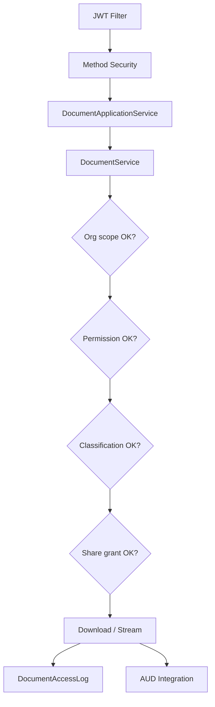

# DOC-001 — Security Architecture

---

## 1. Security Principles

1. **Organization isolation** — every document scoped by `organizationId`
2. **Least privilege** — RBAC via DOC permissions
3. **Defense in depth** — JWT + method security + document-level checks
4. **No direct storage access** — clients never receive raw bucket credentials
5. **Audit everything sensitive** — access logs + AUD integration
6. **Classification aware** — CONFIDENTIAL/RESTRICTED documents enforce stricter rules

---

## 2. Authentication

- All `/api/v1/documents/**` endpoints require JWT Bearer (GPS-001 §17)
- Issued by GovOS IDM/auth module
- Token carries: `sub` (username), authorities, optional org context

---

## 3. Authorization (RBAC)

### Platform permissions (proposed)

| Permission | Scope |
|------------|-------|
| `DOC_READ` | View metadata, list documents |
| `DOC_WRITE` | Upload, update metadata |
| `DOC_DOWNLOAD` | Download binary |
| `DOC_DELETE` | Soft delete, restore |
| `DOC_SHARE` | Create shares |
| `DOC_ADMIN` | Retention, provider config, admin APIs |
| `DOC_MONITOR` | Health, metrics, operational dashboards |

Method security: `@PreAuthorize("hasAuthority('DOC_*')")` on admin endpoints.

### Document-level authorization

Even with `DOC_READ`, service layer verifies:

- User belongs to document's `organizationId`
- Document `visibility` allows access
- Active share grant or share token valid
- Classification level ≤ user's clearance (future ABAC extension)

---

## 4. Ownership Model

| Role | Definition |
|------|------------|
| **Owner** | `ownerId` — full control within permission bounds |
| **Creator** | `createdBy` — audit trail |
| **Organization** | All org members per visibility rules |
| **Share recipient** | Time-limited grant via `DocumentShare` |

Products attach `referenceId` + `entityType` for business context — DOC enforces platform rules, products enforce business rules.

---

## 5. Organization Isolation

- Every query filters `organizationId`
- Cross-org access **denied** unless explicit platform super-admin role (future SEC module)
- Share links scoped to organization + token

---

## 6. Download Authorization

| Method | Use case |
|--------|----------|
| **Proxied stream** | API streams through `govos-api` after auth check |
| **Signed URL** | Short-lived pre-signed URL from storage provider |
| **Temporary token** | One-time download token in share link |

Configuration:
```yaml
govos.doc.security:
  download-mode: proxied  # proxied | signed-url
  signed-url-ttl-seconds: 300
  max-downloads-per-share: 10
```

Signed URLs:
- Generated only after authorization check
- TTL ≤ 15 minutes default
- Single-use option for external shares

---

## 7. JWT Integration

- Standard platform JWT validation filter
- MDC: `userId`, `organizationId`, `requestId`
- Document access logs capture userId from security context

---

## 8. Audit Logging

| Layer | Records |
|-------|---------|
| **DocumentAccessLog** | VIEW, DOWNLOAD, PREVIEW, SHARE — operational |
| **AUD module** | Platform audit trail for compliance |
| **Security filter** | HTTP access log (URI, status, duration) |

Never log: file content, OCR text, share tokens (hash only), storage credentials.

---

## 9. Document Classification

| Level | Rules |
|-------|-------|
| `PUBLIC` | Org-authenticated read |
| `INTERNAL` | Org members only |
| `CONFIDENTIAL` | Role + clearance required |
| `RESTRICTED` | Explicit grant only; no external share |

Classification set at upload; elevation requires `DOC_ADMIN`.

---

## 10. Virus Scan Gate

- Upload may complete to `PENDING_SCAN` state
- Download blocked until `CLEAN` (configurable strict mode)
- Infected files: quarantine key prefix, alert `DOC_ADMIN`, AUD event

---

## 11. Watermarking (Future DOC-016)

- Dynamic watermark on download for CONFIDENTIAL+
- User identity + timestamp embedded in PDF/image
- Applied at download time or preview generation — not stored in original

---

## 12. Digital Signature (Future)

- Provider abstraction only in DOC-001
- Signed documents store signature metadata reference
- Verification via future `SignatureProvider` port

---

## 13. Security Diagram



---

## 14. Prohibited

- Public unauthenticated download (except explicit PUBLIC + token policy)
- Bucket credentials in API responses
- Bypassing DOC for product file storage
- Logging binary content or OCR text
