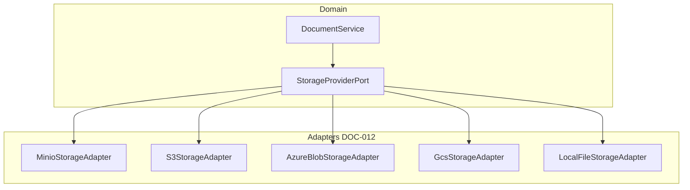

# DOC-001 — Storage Architecture

---

## 1. Design Goals

| Goal | Approach |
|------|----------|
| Vendor neutrality | `StorageProvider` port + adapters |
| Large files | Streaming, multipart/chunk upload |
| Integrity | SHA-256 checksum on upload |
| Security | Encryption at rest (provider/SSE), TLS in transit |
| Efficiency | Deduplication by checksum (optional) |
| Recovery | Backup/restore at provider + metadata replay |

---

## 2. Logical vs Physical Storage

| Layer | Stores | Technology |
|-------|--------|------------|
| **Logical** | Document identity, versions, metadata | PostgreSQL `doc_*` |
| **Physical** | Binary blobs | Object storage (MinIO, S3, …) |

**Rule:** PostgreSQL never stores file bytes (except tiny dev fixtures). Maximum metadata size limits apply to JSONB only.

---

## 3. StorageProvider Port (Conceptual)

```java
// DOC-012 — interface only, not implemented in DOC-001
public interface StorageProviderPort {
    StorageResult putObject(StoragePutRequest request, InputStream stream);
    InputStream getObject(StorageRef ref);
    void deleteObject(StorageRef ref);
    SignedUrl createSignedUrl(StorageRef ref, Duration ttl);
    boolean exists(StorageRef ref);
    StorageMetadata headObject(StorageRef ref);
}
```

**StorageRef:** `{ providerCode, bucket, key, versionId? }`

---

## 4. Provider Implementations (Roadmap)

| Provider | Type enum | Environment |
|----------|-----------|-------------|
| MinIO | `MINIO` | Dev, on-prem prod |
| Amazon S3 | `S3` | Cloud prod |
| Azure Blob | `AZURE_BLOB` | Cloud prod |
| Google Cloud Storage | `GCS` | Cloud prod |
| Local filesystem | `LOCAL` | **Development only** |

Factory selects provider via `govos.doc.storage.default-provider` configuration.

---

## 5. Object Key Strategy

```
{organizationId}/{moduleCode}/{documentId}/{versionNumber}/{sanitizedFilename}
```

Example:
```
550e8400-e29b-41d4-a716-446655440000/cmp/a1b2c3d4-.../3/evidence-photo.jpg
```

- Keys are opaque to products
- `storedFilename` in DB mirrors key tail for debugging only

---

## 6. Streaming & Large Files

| Size | Strategy |
|------|----------|
| < 10 MB | Single PUT stream |
| 10 MB – 5 GB | Multipart/chunk upload |
| > 5 GB | Multipart with configurable part size |

Configuration:
```yaml
govos.doc.storage:
  multipart-threshold-bytes: 10485760
  max-file-size-bytes: 5368709120
  chunk-size-bytes: 8388608
```

Stream from HTTP request → digest pipeline → storage adapter without full memory buffer.

---

## 7. Checksum & Deduplication

1. Compute SHA-256 while streaming upload
2. Store checksum on `DocumentVersion`
3. Optional dedup: if checksum exists for same org + policy allows, reference existing blob (DOC-012 decision)

---

## 8. Encryption

| Layer | Method |
|-------|--------|
| In transit | TLS 1.2+ to storage API |
| At rest | Provider SSE (S3-SSE, Azure SSE, MinIO encryption) |
| Client-side | Optional future — key management via platform vault |

Encryption keys managed outside application code (KMS, vault).

---

## 9. Compression

- Store originals uncompressed by default
- Optional gzip for text/log types (config flag)
- Previews/thumbnails stored as compressed JPEG/WebP

---

## 10. Backup & Restore

| Component | Strategy |
|-----------|----------|
| PostgreSQL metadata | Platform backup (daily snapshot) |
| Object storage | Provider replication / versioning / cross-region |
| Disaster recovery | Restore bucket + replay metadata from DB backup |
| Version immutability | Object versioning enabled on bucket where supported |

Restore procedure documented in DOC-019 operations guide.

---

## 11. Provider Abstraction Diagram



---

## 12. Configuration (Future)

```yaml
govos.doc.storage:
  default-provider: minio
  minio:
    endpoint: ${GOVOS_DOC_MINIO_ENDPOINT}
    access-key: ${GOVOS_DOC_MINIO_ACCESS_KEY}
    secret-key: ${GOVOS_DOC_MINIO_SECRET_KEY}
    bucket: govos-documents
  encryption-at-rest: true
  signed-url-ttl-seconds: 300
```

Secrets via environment only (GPS-001 §18).

---

## 13. Prohibited

- Products writing to buckets directly
- Storing blobs in PostgreSQL BYTEA (except explicit ADR)
- Hardcoded bucket names in domain services
- Local filesystem provider in production
