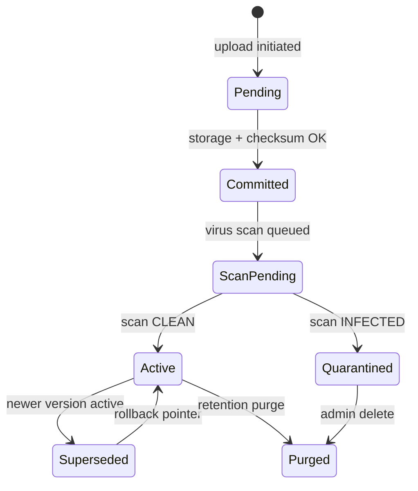

# DOC-001 — Versioning Strategy

---

## 1. Version Model

GovOS uses **immutable append-only versions** with a mutable **active version pointer** on the Document aggregate.

| Concept | Behavior |
|---------|----------|
| **Version number** | Monotonic integer: 1, 2, 3, … |
| **Version label** | Optional display label: `1.0`, `2.1` (major.minor) |
| **Immutability** | Once committed, version blob and checksum never change |
| **Active version** | `Document.activeVersionId` — default for download/preview |
| **History** | All versions retained until retention purge |

---

## 2. Major / Minor Semantics

| Upload type | Version increment |
|-------------|-------------------|
| New file upload (replace) | Major: `n+1` (new integer) |
| Metadata-only correction | No new version |
| Optional minor revision | Config: `versionLabel` major.minor without new blob (rare) |

**Default:** Each new binary upload creates next integer version.

---

## 3. Version Lifecycle

---

## 4. Upload New Version Flow

1. Validate user has `DOC_WRITE` on document
2. Stream new blob to storage (new key)
3. Create `DocumentVersion` with `versionNumber = max + 1`
4. Update `Document.activeVersionId`
5. Mark previous version `Superseded` (status flag)
6. Trigger async: virus scan, OCR, preview, thumbnail
7. Re-index SRH with new metadata
8. Emit `DocumentVersionCreated` event

---

## 5. Rollback

Rollback is **pointer change only**:

1. Admin selects target `versionNumber`
2. Validate version exists and not quarantined
3. Set `Document.activeVersionId` to target version
4. Emit audit event — no blob deletion
5. SRH re-index with active version metadata

**Not allowed:** Mutating or deleting committed version blobs (except retention purge).

---

## 6. Active Version Rules

| Operation | Uses active version |
|-----------|---------------------|
| Download (default) | Yes |
| Preview | Yes |
| Share link | Yes — unless version pinned in share |
| SRH search snippet | Active version metadata + OCR |
| CMP attachment reference | May pin specific `documentVersionId` for evidence integrity |

Products may store pinned `documentVersionId` on business entities (UUID reference only — see CMP complaint attachment pattern).

---

## 7. Retention & Purge

| Policy action | Effect on versions |
|---------------|-------------------|
| `ARCHIVE` | Document status ARCHIVED; blobs retained |
| `DELETE` | Soft delete document; blobs retained until purge job |
| `PURGE` | Physical delete blobs + soft-delete metadata |
| Legal hold | Blocks purge regardless of age |

Scheduler (DOC-018) executes purge based on `DocumentRetentionPolicy`.

---

## 8. Checksum Integrity

- Each version stores SHA-256 at commit time
- Optional periodic integrity job re-heads object and verifies checksum
- Mismatch triggers `DOC_ADMIN` alert and download block

---

## 9. Version Metadata

Per version:
- `originalFilename`, `mimeType`, `sizeBytes`, `checksum`
- `uploadedById`, `uploadedAt`
- `virusScanStatus`, `previewStorageKey`, `thumbnailStorageKey`
- Optional `DocumentMetadata` per version for OCR text scope

---

## 10. Comparison with SRH Sync Version

| DOC | SRH |
|-----|-----|
| Binary version history | Search index sync version |
| Source of truth for files | Search metadata mirror |
| `DocumentVersion.versionNumber` | `SearchDocument.searchVersion` (independent) |

SRH indexes **current active** document metadata unless product pins version in search payload.

---

## 11. Events

| Event | When |
|-------|------|
| `DocumentVersionCreated` | New version committed |
| `DocumentVersionActivated` | Active pointer changed (incl. rollback) |
| `DocumentVersionPurged` | Blob physically deleted |

---

## 12. Prohibited

- Overwriting storage keys in place
- Deleting version rows (soft-delete metadata only until purge)
- Products maintaining parallel file version history outside DOC
