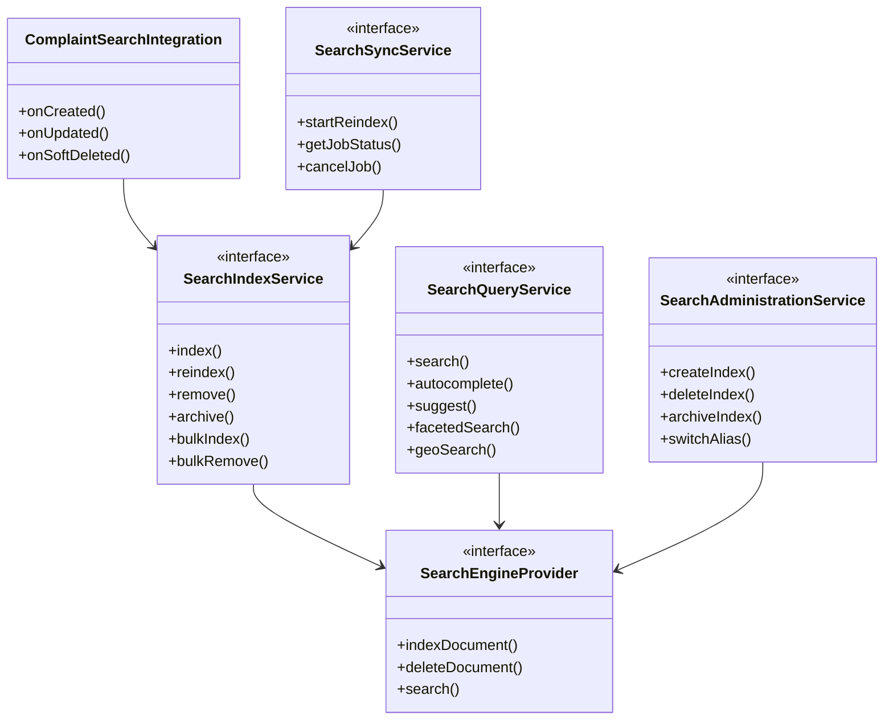
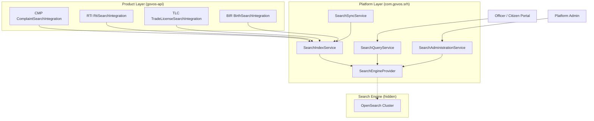
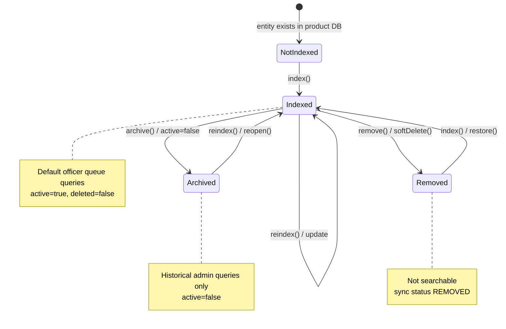
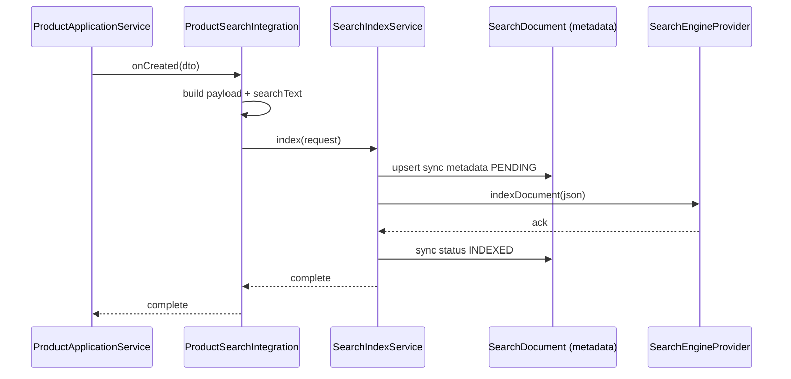
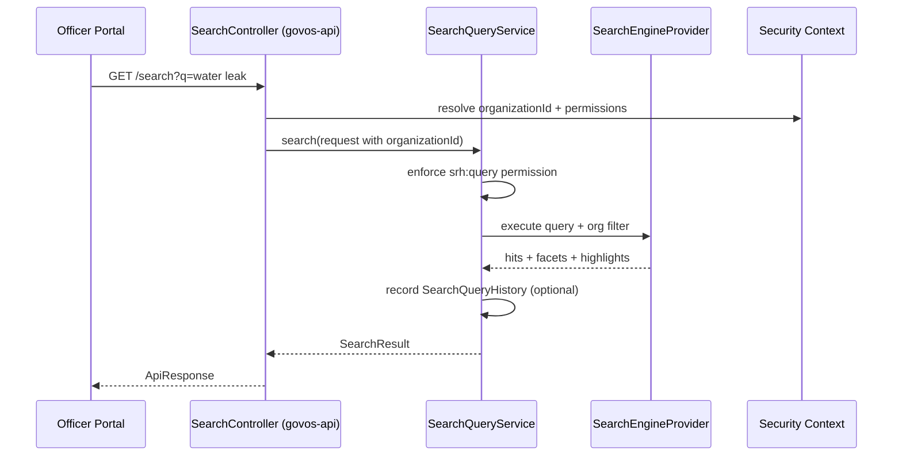
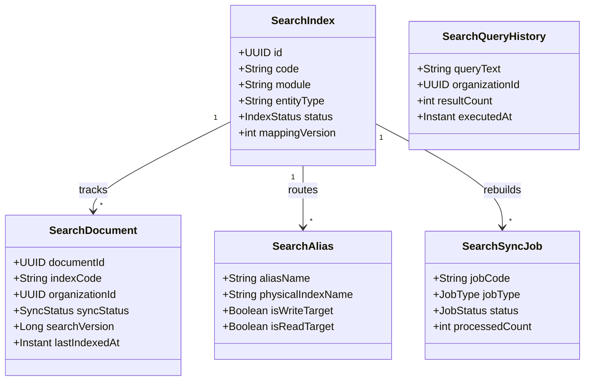
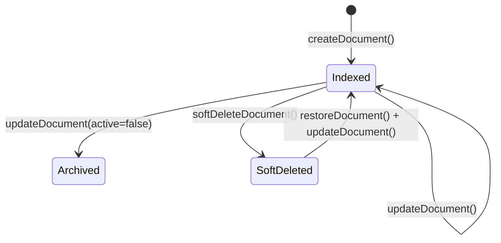

# GovOS Search (SRH)

**SRH v1.0.0 — Platform Certified | Feature Complete**

Search bounded context for the GovOS Enterprise Government Platform.

> **Release status:** SRH v1.0.0 certified (2026-07-18). Milestones SRH-001 through SRH-020 complete.  
> **Certification docs:** [`docs/release-1.0/`](./docs/release-1.0/CERTIFICATION_INDEX.md)

---

## SRH v1.0.0 Certification

| Field | Value |
|-------|-------|
| **Release** | v1.0.0 |
| **Status** | ✅ Certified — Feature Complete |
| **Milestones** | SRH-001 through SRH-020 |
| **Build** | `mvn -pl govos-api -am test` → BUILD SUCCESS |
| **Documentation** | 10 guides + 6 certification artifacts |

### Final Architecture (v1.0)

```
Product (CMP, …)
      ↓
SearchApplicationService          ← govos-api orchestration
      ↓
┌─────────────────────────────────────────────────────┐
│  com.govos.srh (govos-domain)                        │
│  service · query · admin · ai · engine               │
│  production · scheduler · observability              │
└──────────────────────┬──────────────────────────────┘
                       ↓
              OpenSearch 2.x + PostgreSQL (srh_*)
```

### Certification Documentation

| Guide | Path |
|-------|------|
| Architecture | [ARCHITECTURE_GUIDE.md](./docs/release-1.0/ARCHITECTURE_GUIDE.md) |
| Developer | [DEVELOPER_GUIDE.md](./docs/release-1.0/DEVELOPER_GUIDE.md) |
| Operations | [OPERATIONS_GUIDE.md](./docs/release-1.0/OPERATIONS_GUIDE.md) |
| Deployment | [DEPLOYMENT_GUIDE.md](./docs/release-1.0/DEPLOYMENT_GUIDE.md) |
| API Reference | [API_REFERENCE.md](./docs/release-1.0/API_REFERENCE.md) |
| Configuration | [CONFIGURATION_REFERENCE.md](./docs/release-1.0/CONFIGURATION_REFERENCE.md) |
| Troubleshooting | [TROUBLESHOOTING_GUIDE.md](./docs/release-1.0/TROUBLESHOOTING_GUIDE.md) |
| Security | [SECURITY_GUIDE.md](./docs/release-1.0/SECURITY_GUIDE.md) |
| Performance | [PERFORMANCE_GUIDE.md](./docs/release-1.0/PERFORMANCE_GUIDE.md) |
| Integration | [INTEGRATION_GUIDE.md](./docs/release-1.0/INTEGRATION_GUIDE.md) |
| Release Notes | [RELEASE_NOTES.md](./docs/release-1.0/RELEASE_NOTES.md) |
| Compatibility Matrix | [COMPATIBILITY_MATRIX.md](./docs/release-1.0/COMPATIBILITY_MATRIX.md) |

---

**SRH-001 — Architecture Blueprint**

> Implementation complete through SRH-020. See sprint sections below for historical detail.

---

## 1. Purpose

SRH is a **platform shared service** — not a product. Every GovOS product (CMP, RTI, Trade License, Water Tax, Birth Registration, Death Registration, Assets, Inventory, and future modules) consumes search through **service interfaces only**. No product talks to OpenSearch, Elasticsearch, Solr, or Lucene directly.

### Why Search is platform-owned

| Concern | Platform (SRH) | Product (CMP, RTI, …) |
|---------|----------------|-------------------------|
| Index schema and mapping | ✅ | ❌ |
| OpenSearch cluster connectivity | ✅ | ❌ |
| Full-text query engine | ✅ | ❌ |
| Facets, highlighting, geo queries | ✅ | ❌ |
| Business entity lifecycle | ❌ | ✅ |
| When to index / reindex | ❌ (orchestrated at application layer) | ✅ (via integration) |
| Searchable field selection | ❌ (SRH stores payload) | ✅ (product builds document) |

**Design principle:** Products decide **what** to index and **when**; SRH decides **how** indexing and querying work across the platform.

### Ownership boundaries

```
┌─────────────────────────────────────────────────────────────────┐
│  EXPERIENCE (Angular / Flutter / WhatsApp)                       │
└───────────────────────────────┬─────────────────────────────────┘
                                │ HTTPS (future SRH REST)
┌───────────────────────────────▼─────────────────────────────────┐
│  govos-api                                                       │
│  Product controllers + {Product}SearchIntegration               │
└───────────────────────────────┬─────────────────────────────────┘
                                │ SearchIndexService / SearchQueryService
┌───────────────────────────────▼─────────────────────────────────┐
│  govos-domain — com.govos.srh  (PLATFORM)                        │
│  Index metadata · Sync jobs · Query abstraction                  │
└───────────────────────────────┬─────────────────────────────────┘
                                │ SearchEngineProvider (abstraction)
┌───────────────────────────────▼─────────────────────────────────┐
│  OpenSearch / Elasticsearch / Solr / Lucene  (FUTURE — hidden)   │
└─────────────────────────────────────────────────────────────────┘
```

CMP-015 established the consumer pattern: `ComplaintSearchIntegration` in `com.govos.api.cmp.search` calls `SearchIndexService` synchronously within the product application transaction. SRH-001 formalizes the full platform design that stub and future implementations will follow.

---

## 2. Responsibilities

### Search owns

| Capability | Description |
|------------|-------------|
| **Index creation** | Register logical indexes (`CMP_COMPLAINT`, `RTI_APPLICATION`) with mapping metadata |
| **Document indexing** | Accept normalized documents and persist to search engine |
| **Reindex** | Update existing documents; support version-aware upserts |
| **Delete** | Remove documents from active search index |
| **Archive** | Mark documents inactive (`active=false`) without physical delete |
| **Search** | Full-text and filtered query execution |
| **Suggestions** | Typeahead and autocomplete across configured fields |
| **Facets** | Aggregations on status, category, department, date ranges |
| **Pagination** | Cursor and offset pagination with stable sort |
| **Highlighting** | Snippet generation for matched terms |
| **Geo search** | Radius and bounding-box queries on indexed coordinates |
| **Bulk index / delete** | Batch operations for backfill and recovery |
| **Alias management** | Zero-downtime index rotation |
| **Sync job tracking** | Metadata for reindex and backfill jobs |
| **Query history** | Optional audit of executed searches (org-scoped) |
| **Multi-tenancy enforcement** | Every query filtered by `organizationId` |
| **Engine abstraction** | Pluggable backend — products never see engine APIs |

### Search does NOT own

| Capability | Owner |
|------------|-------|
| Workflow orchestration | WRK |
| Audit trail (who changed what) | AUD |
| Notification delivery | NTF |
| Authentication / authorization enforcement | SEC (+ IDM permissions) |
| Business rules and state machines | Product domain (CMP, RTI, …) |
| Document binary storage | DOC |
| User / role management | IDM |
| Master data definitions | MDM |
| When a complaint transitions to RESOLVED | CMP |

SRH records **search metadata** and executes **search operations**. It never validates complaint categories, assigns officers, or sends SMS alerts.

---

## 3. Aggregate Roots

Five aggregates partition search concerns. All extend platform `AuditableEntity` conventions (optimistic locking, soft-delete) when implemented.

### 3.1 `SearchIndex` (primary configuration aggregate)

**Purpose:** Logical index definition — the stable name products reference (`indexCode`).

| Attribute | Role |
|-----------|------|
| `code` | Business key, e.g. `CMP_COMPLAINT`, `RTI_APPLICATION` |
| `name` | Human-readable label |
| `module` | Owning platform/product module code (`CMP`, `RTI`, `TLC`) |
| `entityType` | Polymorphic type, e.g. `COMPLAINT`, `RTI_APPLICATION` |
| `mappingVersion` | Schema version for index mapping migrations |
| `status` | `ACTIVE`, `ARCHIVED`, `REBUILDING` |
| `organizationScoped` | Always `true` for GovOS v1 |

**Why an aggregate:** Index lifecycle (create → publish → rebuild → archive) is a consistency boundary. Mapping changes and alias switches must not leave products with broken index codes.

### 3.2 `SearchDocument` (index synchronization aggregate)

**Purpose:** PostgreSQL metadata mirror of what exists in the search engine — **not** a duplicate of full searchable content.

| Attribute | Role |
|-----------|------|
| `documentId` | UUID — same as business entity primary key |
| `indexCode` | FK to `SearchIndex.code` |
| `entityType` | Denormalized for query routing |
| `organizationId` | Tenant isolation key |
| `referenceId` | Business entity UUID (often equals `documentId`) |
| `syncStatus` | `PENDING`, `INDEXED`, `FAILED`, `REMOVED`, `ARCHIVED` |
| `searchVersion` | Optimistic version from product payload |
| `lastIndexedAt` | Last successful sync timestamp |
| `lastError` | Failure message for operator dashboards |

**Why an aggregate:** Sync state, retry, and idempotency belong here. OpenSearch holds the searchable JSON; PostgreSQL holds **truth about sync state** for recovery and admin UI.

### 3.3 `SearchAlias` (deployment aggregate)

**Purpose:** Maps logical index codes to physical engine index names for zero-downtime reindex.

| Attribute | Role |
|-----------|------|
| `aliasName` | Stable query target, e.g. `cmp-complaint-active` |
| `physicalIndexName` | Engine-specific index, e.g. `cmp-complaint-v3` |
| `isWriteTarget` | Whether new documents route here |
| `isReadTarget` | Whether queries route here |

**Why an aggregate:** Alias switch is an atomic platform operation. Products continue calling `indexCode = CMP_COMPLAINT`; SRH resolves alias internally.

### 3.4 `SearchSyncJob` (operational aggregate)

**Purpose:** Tracks bulk reindex, backfill, and recovery operations.

| Attribute | Role |
|-----------|------|
| `jobCode` | Unique job identifier |
| `indexCode` | Target index |
| `jobType` | `FULL_REINDEX`, `BULK_INDEX`, `BULK_DELETE`, `ALIAS_SWITCH` |
| `status` | `PENDING`, `RUNNING`, `COMPLETED`, `FAILED`, `CANCELLED` |
| `totalCount` / `processedCount` / `failedCount` | Progress |
| `startedAt` / `completedAt` | Timing |
| `requestedByUserId` | Operator reference → IDM |

**Why an aggregate:** Long-running sync must survive restarts. Job state is independent of individual document sync rows.

### 3.5 `SearchQueryHistory` (analytics aggregate)

**Purpose:** Optional record of executed searches for compliance dashboards and relevance tuning.

| Attribute | Role |
|-----------|------|
| `queryText` | User-entered or API query string |
| `indexCode` | Searched index |
| `organizationId` | Tenant scope |
| `executedByUserId` | → IDM |
| `resultCount` | Hits returned |
| `executedAt` | Timestamp |
| `filtersApplied` | Serialized facet/filter snapshot |

**Why an aggregate:** Append-only query log with its own retention policy. Separated from AUD (business audit) and from `SearchDocument` (index sync).

### Aggregate relationship

```
SearchIndex ─────┬──── SearchDocument[]
                 │
                 ├──── SearchAlias[]
                 │
                 └──── SearchSyncJob[]

SearchQueryHistory  (standalone, references indexCode + organizationId)
```

---

## 4. Value Objects

Immutable domain values — no identity, embedded in aggregates or document payloads.

| Value Object | Fields | Usage |
|--------------|--------|-------|
| `SearchField` | `name`, `type` (`TEXT`, `KEYWORD`, `DATE`, `GEO_POINT`, `NUMERIC`), `searchable`, `filterable`, `sortable` | Index mapping definition |
| `SearchMetadata` | `key`, `value` (string), `valueType` | Product-specific filter facets (departmentId, categoryKey) |
| `SearchCoordinates` | `latitude`, `longitude` | Geo queries; validated ranges |
| `SearchHighlight` | `field`, `snippet`, `matchedTerms[]` | Query response fragment |
| `SearchFacet` | `field`, `buckets[]` (`value`, `count`) | Aggregation result |
| `SearchSort` | `field`, `direction` (`ASC`, `DESC`), `mode` (`STANDARD`, `GEO_DISTANCE`) | Query ordering |

Value objects are serialized into document payloads and query DTOs — never persisted as standalone entities.

---

## 5. Integration Contracts

Products and `govos-api` integration layers call **service interfaces only**. No repository or entity access across module boundaries.

### 5.1 `SearchIndexService`

**Consumer:** Product application integrations (`ComplaintSearchIntegration`, future `RtiSearchIntegration`, …)

**Responsibility:** Write path — index lifecycle for individual documents.

| Operation | Description |
|-----------|-------------|
| `index` | Create document in search engine; record sync metadata |
| `reindex` | Upsert by `documentId`; version check via `searchVersion` |
| `remove` | Delete from active index; mark sync status `REMOVED` |
| `archive` | Set `active=false` in payload; keep for admin/historical query |
| `bulkIndex` | Batch create/update |
| `bulkRemove` | Batch delete |

**CMP-015 alignment:** Current stub exposes `index`, `reindex`, `remove`. Full SRH adds `archive`, bulk operations, and metadata persistence.

### 5.2 `SearchQueryService`

**Consumer:** Product REST controllers, officer portals, citizen search UI (via `govos-api`)

**Responsibility:** Read path — all query execution.

| Operation | Description |
|-----------|-------------|
| `search` | Full-text + filters + pagination + sort |
| `autocomplete` | Prefix match on configured fields |
| `suggest` | Context-aware suggestions (recent, popular) |
| `facetedSearch` | Search with aggregation facets |
| `geoSearch` | Radius / bounding box on `SearchCoordinates` |
| `getById` | Direct document lookup by `documentId` + `indexCode` |

Every method requires `organizationId` — enforced inside SRH, not optional at call site.

### 5.3 `SearchAdministrationService`

**Consumer:** Platform admin UI, DevOps tooling (via `govos-api` `/api/v1/platform/search/*`)

**Responsibility:** Index and alias lifecycle.

| Operation | Description |
|-----------|-------------|
| `createIndex` | Register `SearchIndex`; provision physical index |
| `deleteIndex` | Decommission index (soft-delete metadata) |
| `archiveIndex` | Mark index read-only; no new writes |
| `rebuildIndex` | Create new physical index + alias switch workflow |
| `switchAlias` | Atomic alias rotation |
| `getIndexStatus` | Health, document count, last sync |

Products **never** call this service — admin only.

### 5.4 `SearchSyncService`

**Consumer:** Admin backfill, disaster recovery, scheduled maintenance

**Responsibility:** Job-oriented bulk synchronization.

| Operation | Description |
|-----------|-------------|
| `startReindex` | Create `SearchSyncJob`; reindex all documents for index |
| `startBulkIndex` | Import document batch from product export |
| `getJobStatus` | Poll job progress |
| `cancelJob` | Cancel running job |
| `retryFailed` | Re-process failed document sync rows |

### Service boundary diagram



---

## 6. Supported Operations

Complete operation catalogue for SRH implementation sprints.

| Category | Operation | Service | Sync / Async |
|----------|-----------|---------|--------------|
| **Index** | Create Index | `SearchAdministrationService` | Sync |
| **Index** | Delete Index | `SearchAdministrationService` | Sync |
| **Index** | Archive Index | `SearchAdministrationService` | Sync |
| **Document** | Index Document | `SearchIndexService` | Sync (product tx) |
| **Document** | Update Document | `SearchIndexService.reindex` | Sync |
| **Document** | Delete Document | `SearchIndexService.remove` | Sync |
| **Document** | Archive Document | `SearchIndexService.archive` | Sync |
| **Bulk** | Bulk Index | `SearchIndexService.bulkIndex` | Sync or job |
| **Bulk** | Bulk Delete | `SearchIndexService.bulkRemove` | Sync or job |
| **Query** | Search | `SearchQueryService` | Sync |
| **Query** | Autocomplete | `SearchQueryService` | Sync |
| **Query** | Suggestions | `SearchQueryService` | Sync |
| **Query** | Faceted Search | `SearchQueryService` | Sync |
| **Query** | Geo Search | `SearchQueryService` | Sync |
| **Maintenance** | Reindex | `SearchSyncService` | Async job |
| **Maintenance** | Alias Switch | `SearchAdministrationService` | Sync |

**SRH-001 rule:** Product integrations use **synchronous** `SearchIndexService` calls within the product application transaction (established by CMP-015). Async indexing via Kafka or schedulers is **out of scope** until explicitly approved.

---

## 7. OpenSearch Strategy

### Abstraction layer

SRH introduces `SearchEngineProvider` — the only component that may eventually import an OpenSearch/Elasticsearch client SDK.

```
SearchIndexServiceImpl
        ↓
SearchEngineProvider  ←── interface
        ↓
OpenSearchEngineProvider   (future)
ElasticEngineProvider    (future)
SolrEngineProvider       (future)
InMemoryEngineProvider   (tests / dev)
NoOpEngineProvider       (current CMP-015 stub)
```

### Rules

1. **Products never import** OpenSearch, Elasticsearch, Solr, or Lucene libraries.
2. **SRH never embeds** product-specific field names in engine mappings — products supply JSON payloads; SRH applies common + module-specific mapping templates.
3. **Engine selection** is configuration-driven (`govos.search.engine.type=opensearch`).
4. **Index naming** is internal — products use stable `indexCode`; physical names include version suffix.
5. **Connection pooling, TLS, authentication** to search cluster are SRH infrastructure concerns.

### Future engine support (documented only)

| Engine | Use case |
|--------|----------|
| **OpenSearch** | Primary target — AWS OpenSearch Service, self-hosted |
| **Elasticsearch** | Compatibility mode for existing government deployments |
| **Solr** | Legacy enterprise search migration path |
| **Lucene** | Embedded / edge deployments (single-node) |

No engine SDK in SRH-001. No cluster configuration. No index templates in YAML.

---

## 8. Search Document Model

### 8.1 Common platform fields

Every indexed document — regardless of product — includes these fields in the JSON payload SRH stores:

| Field | Type | Required | Description |
|-------|------|----------|-------------|
| `documentId` | UUID | Yes | Primary key — same as business entity id |
| `entityType` | String | Yes | Polymorphic type (`COMPLAINT`, `RTI_APPLICATION`, `TRADE_LICENSE`) |
| `module` | String | Yes | Owning module code (`CMP`, `RTI`, `TLC`) |
| `organizationId` | UUID | Yes | Tenant isolation — **mandatory filter on every query** |
| `referenceId` | UUID | Yes | Business entity reference (usually equals `documentId`) |
| `title` | String | Recommended | Primary display title |
| `description` | String | Optional | Longer text body |
| `status` | String | Recommended | Business status for filtering |
| `priority` | String | Optional | Priority level |
| `createdDate` | Instant | Yes | Entity creation timestamp |
| `updatedDate` | Instant | Yes | Last modification timestamp |
| `active` | Boolean | Yes | `false` when archived — excluded from default officer queues |
| `deleted` | Boolean | Yes | `true` when soft-deleted — excluded from all user queries |
| `searchText` | String | Yes | Concatenated searchable text (product-built) |
| `metadata` | Object | Optional | Structured `SearchMetadata` key-value pairs for facets |
| `location` | Object | Optional | `SearchCoordinates` for geo search |
| `version` | Long | Yes | Optimistic version for reindex idempotency |

### 8.2 Product extension fields

Products append module-specific fields **inside the JSON payload** without changing SRH core schema:

| Product | Extension examples |
|---------|-------------------|
| **CMP** | `complaintCode`, `categoryKey`, `assignedOfficerId`, `workflowInstanceId` |
| **RTI** | `applicationNumber`, `pioOfficeId`, `responseDueDate` |
| **Trade License** | `licenseNumber`, `businessName`, `wardKey` |
| **Birth Registration** | `registrationNumber`, `childName`, `registrarOfficeId` |

SRH indexes extension fields dynamically (JSON object mapping) — products document their extensions in product READMEs.

### 8.3 Explicit exclusions

| Never in search index | Owner |
|----------------------|-------|
| Attachment binary content | DOC |
| Comment bodies (CMP-015) | CMP builds `searchText` without comments |
| Audit event payloads | AUD |
| Passwords, tokens, PII beyond policy | SEC / product DLP rules |
| AI embedding vectors | Future AI sprint |

---

## 9. Product Integration

### 9.1 Integration pattern (mandatory)

All products follow the **application-layer integration** pattern established by CMP-012 through CMP-015:

```
ProductController
        ↓
ProductApplicationService   (@Transactional)
        ↓
ProductDomainService
        ↓
ProductWorkflowIntegration   (optional)
        ↓
ProductNotificationIntegration   (optional)
        ↓
ProductAuditIntegration   (optional)
        ↓
ProductSearchIntegration   → SearchIndexService ONLY
```

Products **never** call `SearchQueryService` from write paths. Query services are invoked from read-only controllers and portals.

### 9.2 Product catalogue

| Product | Module | `indexCode` | `entityType` | Integration artifact |
|---------|--------|-------------|--------------|-------------------|
| Citizen Grievance (CGMS) | CMP | `CMP_COMPLAINT` | `COMPLAINT` | `ComplaintSearchIntegration` ✅ (CMP-015) |
| Right to Information | RTI | `RTI_APPLICATION` | `RTI_APPLICATION` | `RtiSearchIntegration` (future) |
| Trade License | TLC | `TLC_LICENSE` | `TRADE_LICENSE` | `TradeLicenseSearchIntegration` (future) |
| Water Tax / Connection | WTR | `WTR_CONNECTION` | `WATER_CONNECTION` | `WaterSearchIntegration` (future) |
| Birth Registration | BIR | `BIR_REGISTRATION` | `BIRTH_REGISTRATION` | `BirthSearchIntegration` (future) |
| Death Registration | DCR | `DCR_REGISTRATION` | `DEATH_REGISTRATION` | `DeathSearchIntegration` (future) |
| Asset Management | AST | `AST_ASSET` | `ASSET` | `AssetSearchIntegration` (future) |
| Inventory | INV | `INV_ITEM` | `INVENTORY_ITEM` | `InventorySearchIntegration` (future) |

### 9.3 CMP reference (implemented consumer)

CMP-015 indexes via:

| Application method | SRH operation |
|--------------------|---------------|
| `create()` | `index()` |
| `update()`, lifecycle transitions | `reindex()` |
| `archive()` | `reindex()` with `active=false` |
| `softDelete()` | `remove()` |
| `restore()` | `index()` |

Orchestration order: **Domain → Workflow → Notification → Audit → Search** (single transaction).

### 9.4 Cross-product search (future)

Federated search across modules (e.g. officer global search bar) is an SRH `SearchQueryService` concern — products do not join indexes. SRH may expose multi-index query with unified `organizationId` filter.

### Integration architecture diagram



---

## 10. Search Lifecycle

### 10.1 Document state machine



### 10.2 Lifecycle events (product → SRH)

| Product event | SRH action | Document state |
|---------------|------------|----------------|
| Entity created | `index()` | Indexed |
| Entity updated | `reindex()` | Indexed |
| Entity archived | `reindex(active=false)` or `archive()` | Archived |
| Entity soft-deleted | `remove()` | Removed |
| Entity restored | `index()` | Indexed |

### 10.3 Index lifecycle (admin)

```
DRAFT → ACTIVE → REBUILDING → ACTIVE (new physical index)
                    ↓
                 ARCHIVED → DELETED
```

### End-to-end sequence (write path)



### End-to-end sequence (read path)



---

## 11. Security

Search permissions follow GovOS convention `{module}:{resource}:{action}` (see `docs/backend/security.md`).

### 11.1 SRH permission catalogue

| Permission | Description | Typical roles |
|------------|-------------|---------------|
| `srh:index:create` | Register new logical index | Platform admin |
| `srh:index:update` | Modify index mapping / metadata | Platform admin |
| `srh:index:delete` | Decommission index | Platform admin |
| `srh:query` | Execute search, autocomplete, facets | Officer, citizen (scoped) |
| `srh:admin` | Sync jobs, alias switch, reindex, query history export | Platform admin, DBA |

### 11.2 Enforcement rules

1. **`SearchIndexService`** — invoked from trusted application services inside the same JVM; no HTTP exposure. Permission checks occur at product REST layer (e.g. `cmp:complaint:create`).
2. **`SearchQueryService`** — requires authenticated user with `srh:query` plus product-specific read permission (e.g. `cmp:complaint:read`).
3. **`SearchAdministrationService`** — requires `srh:admin`; never exposed to citizen portals.
4. **Organization scope** — SRH injects `organizationId` from security context into every query. Callers cannot override tenant filter.
5. **Cross-tenant search** — **forbidden**. Attempts to query without `organizationId` or with mismatched tenant → `SearchPermissionException`.

### 11.3 Data visibility

| Field | Citizen | Officer | Admin |
|-------|---------|---------|-------|
| Own complaints | ✅ (filtered) | ✅ | ✅ |
| All org complaints | ❌ | ✅ (department scope via metadata) | ✅ |
| Archived records | ❌ | ✅ (with filter) | ✅ |
| Deleted records | ❌ | ❌ | ✅ (admin recovery only) |
| Query history | ❌ | ❌ | ✅ (`srh:admin`) |

Product-level row filters (department, assignment) are applied **in addition to** SRH tenant filter via query metadata.

---

## 12. Multi-tenancy

GovOS is **organization-scoped**. Every search document and query carries `organizationId`.

### Rules

| Rule | Enforcement |
|------|-------------|
| Index partition | Logical indexes shared; **data** filtered by `organizationId` field |
| Query filter | SRH **always** adds `organizationId = :currentOrg` — not optional |
| Cross-tenant index | **Prohibited** — no shared citizen data across ULBs/states |
| Admin global search | Future super-admin role may query across orgs with explicit audit — out of SRH-001 scope |
| Sync jobs | Scoped to single `organizationId` or full index (admin only) |

### PostgreSQL vs search engine

| Store | Tenant isolation |
|-------|------------------|
| PostgreSQL (`srh_*` tables) | Row-level `organization_id` column + query filters |
| OpenSearch | `organizationId` keyword field — mandatory query clause |

This aligns with ADR-005 (PostgreSQL as system of record) and platform org model (ORG module).

---

## 13. Architectural Decision Records

| ID | Decision | Rationale |
|----|----------|-----------|
| **SRH-ADR-001** | Search is a platform module (`com.govos.srh`), not product code | Reuse across CMP, RTI, certificates, licenses |
| **SRH-ADR-002** | Products call `SearchIndexService` only; never OpenSearch client | Engine swap without product changes |
| **SRH-ADR-003** | Application-layer integration in `govos-api` (not domain events, not AOP) | Explicit orchestration; transactional consistency with CMP-015 |
| **SRH-ADR-004** | Synchronous indexing within product transaction (v1) | Rollback on search failure; no eventual-consistency complexity initially |
| **SRH-ADR-005** | PostgreSQL stores sync metadata; engine stores searchable JSON | Recovery, admin UI, idempotency without parsing engine |
| **SRH-ADR-006** | Stable `indexCode` + internal alias rotation | Zero-downtime mapping migrations |
| **SRH-ADR-007** | Common document envelope + product JSON extensions | Shared facets; product flexibility |
| **SRH-ADR-008** | `organizationId` mandatory on every document and query | Multi-tenant government platform requirement |
| **SRH-ADR-009** | OpenSearch as primary engine target; abstraction for Elastic/Solr/Lucene | Government cloud compatibility |
| **SRH-ADR-010** | Query history separate from AUD | Different retention, volume, and purpose |
| **SRH-ADR-011** | No AI embeddings or vectors in SRH-001 scope | Deferred to AI roadmap |
| **SRH-ADR-012** | Flyway prefix `srh_`; migration version coordinated in infrastructure README | Consistent with MDM, IDM, WRK, AUD pattern |

---

## 14. Future AI Roadmap

Documented for planning only — **no implementation in SRH-001**.

| Capability | Description | Dependency |
|------------|-------------|------------|
| **Semantic Search** | Natural-language queries beyond keyword match | LLM query understanding layer |
| **Embeddings** | Dense vector representation of `searchText` | Embedding model service |
| **Vector Search** | k-NN similarity in OpenSearch k-NN plugin | Vector index per module |
| **OCR** | Extract text from DOC attachments → append to `searchText` | DOC + OCR pipeline |
| **Image Search** | Visual similarity for evidence photos | Computer vision service |
| **Duplicate Detection** | Near-duplicate complaints/applications | Vector similarity + CMP rules |
| **Recommendations** | "Similar cases" for officers | Vector + metadata hybrid ranking |
| **Query understanding** | Spell correction, synonym expansion, intent classification | MDM synonym registry + ML |

### AI architecture placeholder

```
Product payload
        ↓
SearchIndexService
        ↓
┌───────────────────┐
│ Keyword index     │  ← SRH v1
│ Vector index      │  ← SRH AI phase
│ OCR text pipeline │  ← DOC integration
└───────────────────┘
        ↓
SearchQueryService
        ↓
Hybrid ranker (keyword + semantic)
```

AI features remain **opt-in per index** — legacy keyword search continues unchanged.

---

## 15. Architecture Diagrams

### 15.1 Module location

| Artifact | Package | Responsibility |
|----------|---------|----------------|
| `govos-domain` | `com.govos.srh` | SRH aggregates, services, repositories, DTOs, engine abstraction |
| `govos-api` | `com.govos.api.search` (future) | REST controllers, query API |
| `govos-api` | `com.govos.api.{product}.search` | Product write integrations |
| `govos-infrastructure` | `db/migration` | Flyway `V1_*__search.sql` (future — version TBD) |

### 15.2 Package structure (planned)

```
com.govos.srh
├── config          # Engine selection, index defaults
├── controller      # Reserved — REST lives in govos-api
├── dto             # Index/query request and response records
├── entity          # SearchIndex, SearchDocument, SearchAlias, SearchSyncJob, SearchQueryHistory
├── event           # SearchDocumentIndexedEvent, SearchIndexRebuiltEvent (records)
├── exception       # SearchException hierarchy
├── mapper          # Entity ↔ DTO mapping
├── provider        # SearchEngineProvider abstraction + engine adapters
├── repository      # Spring Data JPA repositories
├── service         # SearchIndexService, SearchQueryService, SearchAdministrationService, SearchSyncService
└── validator       # Index code uniqueness, org scope, mapping version rules
```

### 15.3 Platform layer placement

```
┌─────────────────────────────────────────────────────────────────┐
│  EXPERIENCE LAYER                                                │
└───────────────────────────────┬─────────────────────────────────┘
                                │
┌───────────────────────────────▼─────────────────────────────────┐
│  API LAYER (govos-api)                                           │
│  /api/v1/{product}/*  ·  /api/v1/platform/search/*  (future)    │
└───────────────────────────────┬─────────────────────────────────┘
                                │
┌───────────────────────────────▼─────────────────────────────────┐
│  PRODUCT LAYER                                                   │
│  CMP · RTI · TLC · BIR · DCR · AST · INV · …                    │
│  (each: {Product}SearchIntegration → SearchIndexService)         │
└───────────────────────────────┬─────────────────────────────────┘
                                │ consumes
┌───────────────────────────────▼─────────────────────────────────┐
│  PLATFORM LAYER                                                  │
│  MDM · IDM · ORG · DOC · NTF · WRK · AUD · SRH · SEC            │
└───────────────────────────────┬─────────────────────────────────┘
                                │
┌───────────────────────────────▼─────────────────────────────────┐
│  INFRASTRUCTURE                                                  │
│  PostgreSQL (srh_* metadata) · OpenSearch (search engine)        │
└─────────────────────────────────────────────────────────────────┘
```

### 15.4 Class diagram (domain model)



---

## Out of Scope (SRH-001)

- Java source code, Spring beans, JPA entities
- Flyway SQL migrations
- REST controllers and OpenAPI specs
- OpenSearch cluster configuration, index templates, ILM policies
- OpenSearch / Elasticsearch Java client
- Kafka, RabbitMQ, async indexing pipelines
- AI embeddings, vector indexes, OCR pipelines
- Angular search UI components
- Product-specific search integration code (beyond documenting CMP-015 consumer)
- Scheduler for sync jobs

---

## SRH-008 Domain Events

Immutable Java records in `com.govos.srh.event` define the search domain event **contracts** only. They carry aggregate identity, organization context, the actor who caused the change, and event-specific payload fields.

**These are contract classes only. Event publication will be implemented in later platform iterations.**

SRH-008 does not wire `ApplicationEventPublisher`, message brokers, listeners, Kafka, OpenSearch callbacks, or orchestration. SRH services and product integrations remain unchanged.

### Purpose

Domain events provide a stable, versioned vocabulary for search lifecycle changes — index administration, document sync metadata, alias rotation, bulk sync jobs, and query execution — so downstream platform modules can subscribe without coupling to SRH entities or services.

### Common payload

Every event record includes:

| Field | Type | Description |
|-------|------|-------------|
| `aggregateId` | UUID | Aggregate root identifier |
| `code` | String | Stable business code when applicable |
| `organizationId` | UUID | Tenant scope for multi-tenant enforcement |
| `changedByUserId` | UUID | User or system principal that triggered the change |
| `occurredAt` | Instant | When the change occurred |

### Event catalogue

| Aggregate | Event | Additional Fields |
|-----------|-------|-------------------|
| **SearchIndex** | `SearchIndexCreatedEvent` | `engineType`, `mappingVersion` |
| | `SearchIndexUpdatedEvent` | — |
| | `SearchIndexActivatedEvent` | — |
| | `SearchIndexArchivedEvent` | — |
| | `SearchIndexRestoredEvent` | — |
| | `SearchIndexDeletedEvent` | — |
| **SearchDocument** | `SearchDocumentIndexedEvent` | `searchIndexId`, `referenceId`, `entityType`, `status` |
| | `SearchDocumentReindexedEvent` | — |
| | `SearchDocumentArchivedEvent` | — |
| | `SearchDocumentRemovedEvent` | — |
| | `SearchDocumentRestoredEvent` | — |
| **SearchAlias** | `SearchAliasCreatedEvent` | — |
| | `SearchAliasUpdatedEvent` | — |
| | `SearchAliasActivatedEvent` | `searchIndexId`, `aliasName`, `physicalIndexName` |
| | `SearchAliasDeletedEvent` | — |
| **SearchSyncJob** | `SearchSyncJobCreatedEvent` | — |
| | `SearchSyncJobStartedEvent` | — |
| | `SearchSyncJobCompletedEvent` | `searchIndexId`, `jobType`, `processedCount`, `successCount`, `failureCount` |
| | `SearchSyncJobFailedEvent` | — |
| | `SearchSyncJobCancelledEvent` | — |
| **SearchQueryHistory** | `SearchQueryExecutedEvent` | `queryType`, `queryText`, `executionTimeMs`, `resultCount` |

### Future integration points

| Module | Use |
|--------|-----|
| **Audit (AUD)** | Immutable audit trail of index, document sync, alias rotation, and job lifecycle changes |
| **Notification (NTF)** | Platform admin alerts on sync job failure, index rebuild completion, and alias switch |
| **Analytics** | Query volume, latency percentiles, index growth, and reindex throughput reporting |
| **AI** | Query and click-stream signals for semantic ranking, suggestions, and embedding pipelines |
| **Monitoring** | Operational dashboards for sync job health, index status, and search latency SLOs |

Publication from SRH services and consumption by AUD, NTF, analytics pipelines, and observability tooling will be added in later sprints after REST and OpenSearch integration are in place.

---

## SRH-009 Testing

Pure unit tests for the search service, validator, and mapper layers. No Spring context, no database, no REST, no OpenSearch.

### Testing strategy

| Layer | Approach |
|-------|----------|
| **Mapper** | Real MapStruct generated implementations (`*MapperImpl`); assert entity ↔ DTO field mapping, ignored audit/runtime fields, embedded metadata flattening, and UUID relationship exposure |
| **Validator** | Mockito-mocked repositories only; assert business rules throw typed SRH exceptions |
| **Service** | Mockito-mocked repositories, validators, and mappers; assert orchestration, optimistic locking, lifecycle transitions, and negative paths |

Tests live under `src/test/java/com/govos/srh` in packages mirroring production code.

### Fixture strategy

`com.govos.srh.support.SrhTestFixtures` centralizes reusable entity and DTO builders for all five SRH aggregates, avoiding duplicated setup across mapper, validator, and service tests.

### Mockito usage

- `@ExtendWith(MockitoExtension.class)` on validator and service tests
- `@Mock` for repositories, validators, and mappers (services)
- `@InjectMocks` for service implementations under test
- No `@SpringBootTest`, no Testcontainers, no database

### JaCoCo gates

Enforced at `mvn -pl govos-domain verify`:

| Scope | Minimum line coverage |
|-------|----------------------|
| `com.govos.srh.service.impl` | 90% |
| `com.govos.srh.validator` | 90% |
| `com.govos.srh.mapper` | 90% |
| Combined SRH (service + validator + mapper) | 85% |

### Test inventory

| Package | Test classes |
|---------|--------------|
| `com.govos.srh.mapper` | `SearchIndexMapperTest`, `SearchDocumentMapperTest`, `SearchAliasMapperTest`, `SearchSyncJobMapperTest`, `SearchQueryHistoryMapperTest` |
| `com.govos.srh.validator` | `SearchIndexValidatorTest`, `SearchDocumentValidatorTest`, `SearchAliasValidatorTest`, `SearchSyncJobValidatorTest`, `SearchQueryHistoryValidatorTest` |
| `com.govos.srh.service.impl` | `SearchIndexServiceImplTest`, `SearchDocumentServiceImplTest`, `SearchAliasServiceImplTest`, `SearchSyncJobServiceImplTest`, `SearchQueryHistoryServiceImplTest` |
| `com.govos.srh.support` | `SrhTestFixtures` |

---

## SRH-010 Application Layer

Introduces `SearchApplicationService` in `com.govos.api.srh.application` as the orchestration boundary between future REST/product integrations and SRH domain services.

### Purpose

The application layer prepares the platform for HTTP exposure, OpenSearch-backed indexing, and cross-product search consumption without embedding business rules, engine clients, or persistence concerns.

### Layering

```
Presentation (future REST controllers, product integrations)
        ↓
Application (SearchApplicationService)
        ↓
Domain (SearchIndexService, SearchDocumentService, SearchAliasService,
        SearchSyncJobService, SearchQueryHistoryService)
        ↓
Infrastructure (JPA repositories, Flyway, future SearchEngineProvider)
```

| Layer | Responsibility | SRH artifact |
|-------|----------------|--------------|
| **Presentation** | HTTP mapping, JWT context, OpenAPI | `SearchController` (SRH-011) |
| **Application** | Orchestration only — delegates to domain services | `SearchApplicationService`, `SearchApplicationServiceImpl` |
| **Domain** | Business logic, validators, lifecycle, aggregate rules | `com.govos.srh.service.*` |
| **Infrastructure** | Persistence, migrations, search engine adapter (future) | `com.govos.srh.repository.*`, Flyway |

### Responsibilities

- **Delegates to:** `SearchIndexService`, `SearchDocumentService`, `SearchAliasService`, `SearchSyncJobService`, `SearchQueryHistoryService`
- **No** business validation, lifecycle rules, repositories, EntityManager, SQL, workflow, notification, audit, or events
- **No** OpenSearch or search-engine client usage
- **No** asynchronous execution
- Constructor injection only; `@Service` on implementation
- Class-level `@Transactional(readOnly = true)`; write methods override with `@Transactional`

### Future OpenSearch integration point

Implemented in SRH-012 — `SearchEngineProvider` / `OpenSearchEngineProvider` hide OpenSearch behind `SearchIndexService`. Application and REST layers unchanged.

### REST usage

`SearchController` in `com.govos.api.srh.controller` maps HTTP requests to DTOs and delegates to `SearchApplicationService` for index administration, document lifecycle, alias rotation, sync jobs, and query history (implemented in SRH-011).

### Future product integration

Product modules (e.g. CMP `ComplaintSearchIntegration`) will orchestrate document payloads through the application layer or dedicated product hooks that call `SearchDocumentService` via `SearchApplicationService`, keeping products free of engine APIs.

---

## SRH-011 REST API

Exposes search administration over HTTP in `com.govos.api.srh` — index, document, alias, sync job, and query history CRUD and lifecycle operations.

### Purpose

Administration API for platform operators. No OpenSearch client, no search engine integration, and no product orchestration in this sprint — REST presentation only.

### Layering

```
Client (HTTPS)
        ↓
SearchController (com.govos.api.srh.controller)
        ↓
SearchApplicationService (com.govos.api.srh.application)
        ↓
SRH domain services (com.govos.srh.service.*)
```

| Layer | Responsibility | SRH artifact |
|-------|----------------|--------------|
| **Presentation** | HTTP mapping, validation, OpenAPI, `ApiResponse` / `PageResponse` wrappers | `SearchController`, `SearchApiMapper` |
| **Application** | Orchestration — delegates to domain | `SearchApplicationService` |
| **Domain** | Business rules and persistence | Unchanged in this sprint |

### Request flow

1. Client sends authenticated request to `/api/v1/search/**`.
2. Controller validates request body or query parameters (`@Valid`, `PaginationRequest`).
3. Controller delegates to `SearchApplicationService` (SRH create/update DTOs reused where no actor fields are required).
4. Application service delegates to domain services.
5. Controller wraps result in `ApiResponse<T>` or `PageResponse<T>` with request id from `RequestContextUtils`.

### Security

- All endpoints require **JWT Bearer** authentication (`bearerAuth` in OpenAPI).
- `@CurrentUser JwtPrincipal` is available for future actor-scoped operations; CRUD DTOs in this sprint do not expose client-supplied actor ids.
- No new security configuration in this sprint.

### Response wrappers

- Single resources: `ApiResponse<T>` with SRH DTOs (`SearchIndexDto`, `SearchDocumentDto`, etc.).
- Paginated indexes: `ApiResponse<PageResponse<SearchIndexDto>>`.
- Soft deletes: `204 No Content`.
- Creates: `201 Created` with `ApiResponse` body.

### Controller responsibilities

- Map HTTP verbs and paths to `SearchApplicationService` methods.
- Apply Jakarta validation on inbound DTOs.
- Return platform-standard success and error envelopes via `GlobalExceptionHandler`:
  - `SearchIndexNotFoundException` → `404 NOT_FOUND`
  - Other `SearchException` subclasses → `422 SEARCH_ERROR`
- **No** repositories, domain services, EntityManager, OpenSearch, or business logic in the controller.

### REST endpoints

Base path: `/api/v1/search`

| Resource | Methods |
|----------|---------|
| **Indexes** | `POST/PUT/GET/DELETE /indexes`, `GET /indexes/code/{code}`, `POST /indexes/{id}/activate`, `POST /indexes/{id}/archive`, `POST /indexes/{id}/restore` |
| **Documents** | `POST/PUT/GET/DELETE /documents`, `GET /documents/index/{indexId}`, `GET /documents/organization/{organizationId}`, `POST /documents/{id}/restore` |
| **Aliases** | `POST/PUT/GET/DELETE /aliases`, `GET /aliases/index/{indexId}`, `POST /aliases/{id}/activate`, `POST /aliases/{id}/restore` |
| **Sync jobs** | `POST/PUT/GET /jobs`, `GET /jobs/index/{indexId}`, `POST /jobs/{id}/start`, `POST /jobs/{id}/complete`, `POST /jobs/{id}/fail`, `POST /jobs/{id}/cancel` |
| **Query history** | `GET /queries/organization/{organizationId}`, `GET /queries/user/{userId}` |

---

## SRH-012 OpenSearch Integration

Implements the real search engine adapter behind `SearchIndexService`. Only SRH communicates with OpenSearch — products remain decoupled.

### Provider abstraction

```
SearchIndexServiceImpl
        ↓
SearchEngineProvider (interface)
        ↓
OpenSearchEngineProvider (@Service)
        ↓
OpenSearchClient (OpenSearch Java REST client)
```

| Component | Package | Responsibility |
|-----------|---------|----------------|
| `SearchEngineProvider` | `com.govos.srh.engine` | Engine-neutral contract — index, document, bulk, alias, search, health |
| `OpenSearchEngineProvider` | `com.govos.srh.engine` | OpenSearch REST operations; wraps failures as `SearchEngineException` |
| `SearchConfiguration` | `com.govos.srh.config` | Externalized client beans (`RestClient`, `OpenSearchClient`) |
| `SearchProperties` | `com.govos.srh.config` | `govos.search.*` configuration |

### Alias strategy

Zero-downtime rotation via `SearchIndexService.switchAlias(searchIndexId, aliasId)`:

1. Create new physical index (`{code}-v{n+1}`)
2. Bulk copy persisted documents from PostgreSQL metadata
3. Atomically switch alias (`SearchEngineProvider.switchAlias`)
4. Update `SearchAlias` aggregate and archive prior physical index metadata

Write path resolves the active alias when present; otherwise uses `physicalIndexName`.

### Index lifecycle

| Operation | DB first | Engine after |
|-----------|----------|--------------|
| `createPhysicalIndex` | Persist `physicalIndexName` | `createIndex` if not exists |
| `deletePhysicalIndex` | — | `deleteIndex` |
| `indexDocument` / `updateDocument` | — | Upsert JSON payload to alias/physical index |
| `removeDocument` | — | Delete by document id |

OpenSearch operations are **not** part of JPA transactions — metadata commits first, engine sync follows (no distributed transactions).

### Bulk indexing

- `bulkIndex(searchIndexId, List<SearchDocumentDto>)` — batches by `govos.search.bulk-batch-size` (default 500)
- `bulkDelete(searchIndexId, List<UUID>)` — batched document id deletes
- Returns `BulkOperationResult` with success/failure counts

### Configuration

| Property | Description | Default |
|----------|-------------|---------|
| `govos.search.host` | OpenSearch host | `localhost` |
| `govos.search.port` | OpenSearch port | `9200` |
| `govos.search.username` | Basic auth username | — |
| `govos.search.password` | Basic auth password | — |
| `govos.search.ssl` | HTTPS enabled | `false` |
| `govos.search.bulk-batch-size` | Bulk batch size | `500` |

Environment overrides: `GOVOS_SEARCH_HOST`, `GOVOS_SEARCH_PORT`, `GOVOS_SEARCH_USERNAME`, `GOVOS_SEARCH_PASSWORD`, `GOVOS_SEARCH_SSL`.

### Failure handling

- All OpenSearch exceptions wrapped in `SearchEngineException` — never exposed to products or REST
- `health()` returns `UP` (green), `DEGRADED` (yellow), or `DOWN` (red/unreachable)
- Alias switch aborts if bulk copy reports failures

### Future vector search

Vector embeddings and k-NN queries remain out of scope. The `SearchEngineProvider` abstraction allows a future `vectorSearch()` extension without product changes.

### Product integration path

```
ComplaintApplicationService → ComplaintSearchIntegration → SearchApplicationService → SearchIndexService.indexDocument()
```

Product modules serialize documents as JSON (see `ComplaintSearchDocument`) and call SRH through the application layer only.

---

## SRH-013 Product Integration

Wires platform products to SRH through `SearchApplicationService`. Only SRH owns OpenSearch — products never import engine clients.

### Ownership

| Concern | Owner | Artifact |
|---------|-------|----------|
| Search engine (OpenSearch) | SRH | `SearchEngineProvider` → `OpenSearchEngineProvider` |
| Search metadata & lifecycle | SRH | `SearchDocumentService` via `SearchApplicationService` |
| Product document schema | Product | e.g. `ComplaintSearchDocument` (CMP) |
| Product orchestration | Product application layer | e.g. `ComplaintSearchIntegrationImpl` |
| Tenancy (`organizationId`) | Mandatory on every indexed document | Enforced in product mapper + SRH validators |

### Integration stack

```
ComplaintApplicationService
        ↓
ComplaintSearchIntegrationImpl
        ↓
SearchApplicationService
        ↓
SearchDocumentService / SearchIndexService
        ↓
SearchEngineProvider
        ↓
OpenSearch
```

### CMP integration (implemented)

| CMP application hook | SRH `SearchApplicationService` operation | Notes |
|----------------------|------------------------------------------|-------|
| `onCreated` | `createDocument()` | Initial metadata row + JSON payload |
| `onUpdated`, lifecycle transitions | `updateDocument()` | Upsert when metadata row missing |
| `onArchived` | `updateDocument()` | `active=false` via `ComplaintSearchDocument.archived()` |
| `onSoftDeleted` | `softDeleteDocument()` | Requires existing metadata row |
| `onRestored` | `restoreDocument()` then `updateDocument()` | Refreshes payload after restore |
| Feedback hooks | — | No indexing (unchanged) |

Index code: `CMP_COMPLAINT`. Entity type: `COMPLAINT`. Payload: `ComplaintSearchDocument` serialized to `documentJson`.

### Future product contracts (placeholders)

Interfaces only — no implementations in SRH-013:

| Product | Interface | Package |
|---------|-----------|---------|
| DOC | `DocumentSearchIntegration` | `com.govos.api.doc.search` |
| WRK | `WorkflowSearchIntegration` | `com.govos.api.wrk.search` |
| MDM | `MasterDataSearchIntegration` | `com.govos.api.mdm.search` |
| NTF | `NotificationSearchIntegration` | `com.govos.api.ntf.search` |
| AUD | `AuditSearchIntegration` | `com.govos.api.audit.search` |

### Transaction flow

Single `@Transactional` boundary on product application services (CMP reference):

1. Domain operation
2. Workflow sync (where applicable)
3. Notification publish (where applicable)
4. Audit record
5. **Search sync** — synchronous `SearchApplicationService` call

Search failure throws a product integration exception (e.g. `ComplaintSearchIntegrationException`) and rolls back the entire application transaction. No asynchronous indexing.

### Search lifecycle (product view)



CMP temporary `SearchIndexService.index/reindex/remove` stubs from CMP-015 are **removed** — products call `SearchApplicationService` only.

---

## SRH-014 Advanced Query API

Implements the OpenSearch **read path**. All GovOS products search exclusively through SRH — no direct OpenSearch client usage outside `com.govos.srh.engine`.

### Query flow

```
SearchController (/api/v1/search/query|autocomplete|facets|geo|count)
        ↓
SearchApplicationService
        ↓
SearchQueryService (com.govos.srh.query)
        ↓
SearchEngineProvider.advancedSearch / autocomplete / countDocuments / suggest
        ↓
OpenSearchQueryExecutor
        ↓
OpenSearch
```

PostgreSQL remains the source of truth for metadata; OpenSearch serves read-optimized queries only.

### Query capabilities

| Capability | Implementation |
|------------|----------------|
| Full text | `multi_match` on `searchText`, `title`, `description` |
| Phrase | `multi_match` phrase type |
| Wildcard / Boolean | `query_string` |
| Prefix | `multi_match` phrase prefix |
| Fuzzy | `multi_match` with fuzziness AUTO |
| Pagination | `SearchPage` — default 20, max 100 |
| Sorting | `SearchSort` field + direction; geo distance sort |
| Highlighting | OpenSearch highlight — read-only, never mutates stored docs |
| Aggregations | Terms facets for status, priority, category, organization, entityType |

### OpenSearch DSL (read path)

Every query applies a **mandatory** `term` filter on `organizationId`. Default visibility filters: `active=true`, `deleted=false` unless overridden in `SearchFilters`.

Bool query structure:

```
filter: [ organizationId, entityType?, status?, priority?, categoryKey?, subCategoryKey?,
          active?, deleted?, createdDate range?, updatedDate range?, geo filter? ]
must:   [ text query (mode-specific) or match_all ]
```

Geo filters: `geo_distance` (radius km) or `geo_bounding_box` (top-left / bottom-right).

### Facets

`POST /api/v1/search/facets` returns aggregation buckets only (zero hit size). Default facet fields: `status`, `priority`, `category`, `organization`, `entityType`.

### Autocomplete

`POST /api/v1/search/autocomplete` — prefix matching on `searchText`, organization-isolated, max 10 suggestions. History recorded as `SearchQueryType.AUTOCOMPLETE`.

### Geo search

`POST /api/v1/search/geo` — radius (`radiusKm`) or bounding box search on `location` field with optional distance sorting.

### Performance

| Setting | Default | Property |
|---------|---------|----------|
| Page size | 20 | `govos.search.default-page-size` |
| Max page size | 100 | `govos.search.max-page-size` |
| Query timeout | 5s | `govos.search.query-timeout-ms` |

Invalid paging (page &lt; 0, size &gt; max) rejected via `SearchQueryException`.

### Security

- `organizationId` required on every query request — enforced in `SearchQueryValidator` and OpenSearch DSL
- Products cannot search outside their organization tenant boundary
- JWT authentication required on all query endpoints (`bearerAuth`)

### Search history

Every executed query records via `SearchQueryHistoryService.record()`:

| Field | Source |
|-------|--------|
| `queryText` | Request query / prefix |
| `filtersJson` | Serialized `SearchFilters` |
| `executionTimeMs` | Measured wall time |
| `resultCount` | Total hits or suggestion count |
| `queryType` | `SEARCH`, `AUTOCOMPLETE`, `FACET`, or `GEO` |
| `organizationId` / `userId` | Request context |

Write path (`SearchIndexService.indexDocument`, product integrations) unchanged.

---

## SRH-015 Search Administration

Implements platform administration, operational monitoring, analytics, and reindex management for the Search bounded context. No AI, vector search, embeddings, OCR, or semantic search in this sprint.

### Architecture

```
SearchController
        │
        ▼
SearchApplicationService
        │
        ▼
SearchAdministrationService
        │
        ├── SearchIndexService (health, reindex via switchAlias)
        ├── SearchClusterMonitor / SearchIndexMonitor (OpenSearch admin reads)
        ├── SearchQueryHistoryRepository (analytics aggregation)
        └── SearchSyncJobService (reindex job lifecycle)
```

Administration is isolated in `com.govos.srh.admin` — existing entities, repositories, validators, mappers, domain services, query APIs, indexing APIs, product integrations, and OpenSearch read/write implementations are unchanged.

### Cluster monitoring

`OpenSearchClusterMonitor` exposes enriched health via `GET /api/v1/search/admin/health`:

| Metric | Source |
|--------|--------|
| Engine status | `SearchIndexService.health()` → UP / DEGRADED / DOWN |
| Node count | OpenSearch cluster health API |
| Primary / replica shards | OpenSearch cluster health API |
| Disk / memory usage | OpenSearch node stats (aggregated) |
| CPU usage | OpenSearch node stats (average, when available) |

`GET /api/v1/search/admin/cluster` returns cluster name, status, shard counts, and relocation state.

### Operational dashboards

`GET /api/v1/search/admin/dashboard` aggregates:

| Section | Content |
|---------|---------|
| Health | Cluster health DTO |
| Query metrics | Total queries, average response time, 24h/7d volume, daily trend |
| Platform statistics | Index counts, document totals, running/failed jobs |
| Running sync jobs | Active `SearchSyncJob` records (RUNNING) |
| Recent failures | Last failed reindex jobs |
| Index usage | Active indexes with document counts and last reindex time |

### Analytics

Query analytics aggregate `SearchQueryHistory` over a rolling 30-day window (in-memory, no schema changes):

| Metric | Method |
|--------|--------|
| Top searched keywords | `getTopQueries()` |
| Top organizations | `getTopOrganizations()` |
| Top entity types | Parsed from `filtersJson.entityType` |
| Average response time | `getQueryStatistics()` |
| Slowest queries | `getSlowQueries()` |
| Most used filters | `getTopFilters()` |
| Search volume per day | `SearchQueryStatisticsDto.volumePerDay` |

Per-index statistics (`GET /api/v1/search/admin/indexes/{id}/statistics`) combine OpenSearch index stats (document count, deleted count, storage size) with GovOS metadata (alias, mapping version, last indexed/reindexed, search count by entity type).

### Reindex strategy

Reindex administration reuses `SearchSyncJob` and `SearchIndexService.switchAlias()`:

1. Create `FULL_REINDEX` job via `SearchSyncJobService`
2. Start job (RUNNING)
3. Execute `switchAlias(indexId, activeAliasId)` — creates new physical index, bulk copies documents, switches alias
4. Complete job on success; fail job on error

| Operation | Endpoint |
|-----------|----------|
| Single index reindex | `POST /api/v1/search/admin/indexes/{id}/reindex` |
| Full platform reindex | `POST /api/v1/search/admin/reindex-all` |
| Cancel running job | `POST /api/v1/search/admin/jobs/{id}/cancel` |

### Administration APIs

| Method | Path | Permission (reserved) |
|--------|------|----------------------|
| GET | `/api/v1/search/admin/health` | `SRH_MONITOR` |
| GET | `/api/v1/search/admin/cluster` | `SRH_MONITOR` |
| GET | `/api/v1/search/admin/statistics` | `SRH_ADMIN` |
| GET | `/api/v1/search/admin/dashboard` | `SRH_ADMIN` |
| GET | `/api/v1/search/admin/indexes/{id}/statistics` | `SRH_ADMIN` |
| GET | `/api/v1/search/admin/queries/top` | `SRH_ADMIN` |
| GET | `/api/v1/search/admin/queries/slow` | `SRH_ADMIN` |
| POST | `/api/v1/search/admin/indexes/{id}/reindex` | `SRH_REINDEX` |
| POST | `/api/v1/search/admin/reindex-all` | `SRH_REINDEX` |
| POST | `/api/v1/search/admin/jobs/{id}/cancel` | `SRH_REINDEX` |

Authorization is documented only — enforcement deferred to the Security module.

### Tests

| Test | Scope |
|------|-------|
| `SearchAdministrationServiceTest` | Health, cluster, reindex, index statistics |
| `SearchDashboardTest` | Dashboard aggregation |
| `SearchStatisticsTest` | Platform and query analytics |
| `SearchAdminControllerTest` | Admin REST endpoints (MockMvc) |

OpenSearch is mocked in all administration tests.

---

## SRH-016 AI Semantic Search

Introduces AI-powered semantic search alongside the existing keyword (BM25) search path. Keyword search via `POST /api/v1/search/query` remains the **default**. Semantic and hybrid search are **optional** and gated by configuration.

### Architecture

```
SearchController
        │
        ▼
SearchApplicationService
        │
        ▼
SemanticSearchService
        │
        ├── EmbeddingProvider (abstraction — no hardcoded AI vendor)
        ├── VectorIndexService (in-memory for SRH-016)
        ├── HybridRankingService (BM25 + vector merge)
        └── SearchQueryService (keyword leg for hybrid only)
```

No product module communicates with AI models. All AI capabilities are isolated in `com.govos.srh.ai`.

### Provider abstraction

`EmbeddingProvider` exposes:

| Method | Purpose |
|--------|---------|
| `generateEmbedding(text)` | Single-text embedding |
| `generateEmbeddings(texts)` | Batch embedding |
| `embeddingDimension()` | Vector size |
| `health()` | Provider health |
| `providerName()` | Active provider identifier |

Future implementations may target OpenAI, Azure OpenAI, Ollama, SentenceTransformers, Bedrock, Vertex AI, or other providers. SRH-016 ships with `MockEmbeddingProvider` only (deterministic hash-based vectors for dev/test).

### Vector model

`SearchEmbedding` (in-memory, no Flyway in this sprint):

| Field | Description |
|-------|-------------|
| `embeddingId` | Unique embedding identifier |
| `referenceId` | Linked domain document reference |
| `organizationId` | Tenant isolation |
| `entityType` | Entity classification |
| `embeddingVersion` | Model/version tracking |
| `vectorDimension` | Vector size |
| `createdDate` / `updatedDate` | Audit timestamps |

Persisted via `InMemoryVectorIndexService` until a future sprint adds vector store integration.

### Hybrid ranking

`HybridRankingService` combines normalized BM25 keyword scores with cosine-similarity vector scores:

```
combinedScore = (keywordWeight × normalizedKeywordScore) + (semanticWeight × normalizedVectorScore)
```

Default weights (configurable):

| Weight | Default | Property |
|--------|---------|----------|
| Keyword (BM25) | 0.70 | `govos.search.semantic.keyword-weight` |
| Semantic (vector) | 0.30 | `govos.search.semantic.vector-weight` |

### Semantic query flow

```
User query
    ↓
Generate embedding (EmbeddingProvider)
    ↓
Vector search (VectorIndexService)
    ↓
Keyword search (SearchQueryService — hybrid only)
    ↓
Merge result sets by document id
    ↓
Hybrid ranking (HybridRankingService)
    ↓
Paginated SearchResponse
```

### Configuration

| Property | Default | Description |
|----------|---------|-------------|
| `govos.search.semantic.enabled` | `false` | Master switch for semantic/hybrid endpoints |
| `govos.search.semantic.keyword-weight` | `0.70` | BM25 weight in hybrid ranking |
| `govos.search.semantic.vector-weight` | `0.30` | Vector similarity weight |
| `govos.search.semantic.provider` | `mock` | Active embedding provider |
| `govos.search.semantic.top-k` | `20` | Vector retrieval depth |

### REST endpoints

| Method | Path | Description |
|--------|------|-------------|
| POST | `/api/v1/search/semantic` | Pure vector similarity search |
| POST | `/api/v1/search/hybrid` | Combined keyword + semantic ranking |

Existing `POST /api/v1/search/query` is unchanged and remains the default search path.

### Administration dashboard

`GET /api/v1/search/admin/dashboard` now includes `semanticInfo`:

| Field | Description |
|-------|-------------|
| `provider` | Active embedding provider name |
| `embeddingDimension` | Vector dimension |
| `semanticEnabled` | Configuration flag |
| `vectorIndexHealth` | In-memory vector index status |
| `embeddingProviderHealth` | Embedding provider status |
| `indexedEmbeddingCount` | Embeddings in vector index |

### Future provider implementations

| Provider | Status |
|----------|--------|
| Mock (deterministic) | ✅ SRH-016 |
| OpenAI | 🔜 |
| Azure OpenAI | 🔜 |
| Ollama | 🔜 |
| SentenceTransformers | 🔜 |
| AWS Bedrock | 🔜 |
| Google Vertex AI | 🔜 |

### Tests

| Test | Scope |
|------|-------|
| `SemanticSearchServiceTest` | Semantic + hybrid flows, disabled guard |
| `HybridRankingServiceTest` | Score normalization and merge |
| `EmbeddingProviderTest` | Mock provider determinism |
| `SemanticSearchControllerTest` | REST endpoints (MockMvc) |

All tests use mock embeddings — no external AI service required.

---

## SRH-017 Production Readiness

Prepares SRH for production deployment with resilience, performance, observability, security, and operational readiness. No business feature changes — all improvements live in `com.govos.srh.production`.

### Operational deployment

Production profile (`application-prod.yml`) enables cache warming, expanded connection pools, and Prometheus metrics exposure. OpenSearch connectivity is configured via environment variables (`GOVOS_SEARCH_HOST`, `GOVOS_SEARCH_PORT`, credentials, SSL).

### Retry strategy

`ResilientSearchEngineProvider` (primary `SearchEngineProvider` decorator) wraps all OpenSearch operations with:

| Capability | Implementation |
|------------|----------------|
| Retry count | Configurable `govos.search.resilience.max-retries` (default 3) |
| Exponential backoff | `initial-backoff-ms`, `max-backoff-ms`, `backoff-multiplier` |
| Timeout handling | RestClient connect/socket timeouts + query timeout |
| Connection recovery | Retries on connection/timeout/503/429 errors |
| Graceful degradation | Empty read results when cluster unavailable (reads only) |
| Bulk failure reporting | Micrometer `bulk.failures` + existing `BulkOperationResult` counts |

All failures surface as `SearchEngineException`.

### Performance tuning

| Feature | Configuration |
|---------|---------------|
| Read caching | Caffeine cache for cluster health/info (`CachedSearchClusterMonitor`) |
| Cache eviction | TTL + max entries; manual `evict` / `evictAll` |
| Cache warming | `govos.search.cache.warm-on-startup` |
| Connection pooling | Apache HttpClient max connections per route/total |
| Compression | `govos.search.pool.compression` |
| Bulk batching | Existing `bulk-batch-size` (unchanged) |
| Deep pagination guard | `guard.max-deep-pagination-offset`, `guard.max-result-window` |
| Query timeout | `query-timeout-ms` (unchanged, enforced via OpenSearch DSL) |

### Monitoring & metrics

Micrometer metrics exposed via `/actuator/prometheus` (prod):

| Metric | Description |
|--------|-------------|
| `search.requests` | Query operation counters |
| `search.duration` | Query latency timer |
| `search.errors` | Failed operations |
| `search.bulk.operations` | Bulk index/delete activity |
| `search.index.operations` | Index create/delete |
| `search.alias.switches` | Alias switch operations |
| `semantic.requests` / `semantic.duration` | Semantic/hybrid search |
| `autocomplete.requests` | Autocomplete queries |
| `facet.requests` | Facet aggregations |
| `geo.requests` | Geo searches |
| `bulk.failures` | Partial bulk failure count |
| `cluster.health` | Cluster status transitions |

### Structured logging

`SearchStructuredLogger` emits operation logs with: `operation`, `status`, `durationMs`, `organizationId`, `requestId`, `indexCode`, `entityType`, `referenceId`. Never logs document JSON, embeddings, or PII.

### Security

Controller-level `@PreAuthorize` enforcement on admin endpoints:

| Permission | Endpoints |
|------------|-----------|
| `SRH_MONITOR` | `/admin/health`, `/admin/health/operational`, `/admin/cluster` |
| `SRH_ADMIN` | `/admin/statistics`, `/admin/dashboard`, index/query analytics |
| `SRH_REINDEX` | Reindex and job cancel operations |

Enabled via `@EnableMethodSecurity` in `SearchSecurityConfiguration`.

### Health

New endpoint: `GET /api/v1/search/admin/health/operational` returns `SearchOperationalHealthDto`:

| Field | Source |
|-------|--------|
| Cluster status, nodes, disk, heap | OpenSearch cluster + node stats |
| Pending tasks, unassigned shards | Cluster health API |
| Index availability | Engine health status |
| Semantic provider / vector index health | `SemanticSearchService` |
| Cache health / entries | `SearchReadCache` |

### Configuration reference

```yaml
govos.search:
  resilience: { max-retries, initial-backoff-ms, max-backoff-ms, backoff-multiplier, graceful-degradation }
  cache: { enabled, ttl-seconds, max-entries, warm-on-startup }
  pool: { max-connections, max-connections-per-route, connection-timeout-ms, socket-timeout-ms, compression }
  guard: { max-result-window, max-deep-pagination-offset }
  metrics: { enabled }
  semantic: { enabled, keyword-weight, vector-weight, provider, top-k }
```

### Tests

| Test | Scope |
|------|-------|
| `OpenSearchRetryExecutorTest` | Retry and backoff |
| `SearchProductionGuardTest` | Pagination limits |
| `SearchReadCacheTest` | Cache hit/miss/eviction |
| `SearchMetricsRecorderTest` | Micrometer registration |
| `SearchOperationalHealthServiceTest` | Operational health aggregation |
| `SearchProductionPropertiesTest` | Configuration defaults |
| `SearchAdminSecurityTest` | `@PreAuthorize` annotations |

---

## SRH-018 Production AI Providers

Production-grade semantic search provider integrations for OpenAI, Azure OpenAI, and Ollama. All AI provider communication remains inside the SRH bounded context — products never call embedding APIs directly.

### Provider architecture

```
Product → SearchApplicationService → SemanticSearchService
    → ProductionEmbeddingProvider (@Primary)
        → CachedEmbeddingProvider
            → EmbeddingProviderFactory → OpenAI / Azure / Ollama / Mock
    → VectorIndexService → OpenSearchVectorIndexService (prod) | InMemoryVectorIndexService (dev)
```

| Provider | Config value | Package |
|----------|--------------|---------|
| Mock (dev) | `mock` | `com.govos.srh.ai.MockEmbeddingProvider` |
| OpenAI | `openai` | `com.govos.srh.ai.provider.OpenAIEmbeddingProvider` |
| Azure OpenAI | `azure-openai` | `com.govos.srh.ai.provider.AzureOpenAIEmbeddingProvider` |
| Ollama | `ollama` | `com.govos.srh.ai.provider.OllamaEmbeddingProvider` |

`EmbeddingProviderFactory` validates configuration at startup, selects the configured provider, and falls back to mock when misconfigured.

### Configuration

```yaml
govos.search.semantic:
  provider: mock | openai | azure-openai | ollama
  vector-store: memory | opensearch
  vector-index-name: govos-vector-index
  embedding-version: 1
  embedding-batch-size: 50
  openai: { api-key, model, base-url, dimension }
  azure: { endpoint, api-key, deployment, api-version, dimension }
  ollama: { base-url, model, dimension }
  embedding-cache: { enabled, ttl-seconds, max-entries }
```

Environment variable overrides: `GOVOS_SEARCH_OPENAI_API_KEY`, `GOVOS_SEARCH_AZURE_ENDPOINT`, `GOVOS_SEARCH_AZURE_API_KEY`, `GOVOS_SEARCH_OLLAMA_BASE_URL`, etc.

Production profile sets `vector-store: opensearch`.

### Embedding cache

Caffeine cache keyed by `provider + model + SHA-256(text)`. Configurable TTL and max entries. Failures are never cached.

### Vector storage

`OpenSearchVectorIndexService` stores vectors in a dedicated kNN index with versioned document IDs (`{referenceId}-v{version}`). Changing `embedding-version` does not overwrite previous vectors until migration completes.

### Background jobs & migration

| Service | Responsibility |
|---------|----------------|
| `EmbeddingGenerationService` | Batch embedding generation, retry, progress tracking |
| `EmbeddingMigrationService` | Version migration, rebuild, rollback |

### Health & monitoring

Provider health: `UP`, `DOWN`, `DEGRADED`, `UNKNOWN`. Integrated into dashboard (`SearchSemanticInfoDto`), operational health, and new admin endpoint:

`GET /api/v1/search/admin/semantic/provider` (requires `SRH_MONITOR`)

### Metrics (additive)

| Metric | Description |
|--------|-------------|
| `embedding.requests` | Embedding generation requests |
| `embedding.duration` | Embedding latency |
| `embedding.errors` | Failed embedding calls |
| `provider.health` | Provider health transitions |
| `provider.calls` | Provider/cache call counts |
| `provider.tokens` | Token usage (when reported) |
| `vector.index.operations` | Vector index CRUD |
| `vector.search.operations` | kNN search operations |

### Logging

Structured SLF4J logging via `CachedEmbeddingProvider` — logs provider, duration, status, batch size, error code only. Never logs API keys, raw embeddings, document JSON, or full prompts.

### Tests

| Test | Scope |
|------|-------|
| `OpenAIEmbeddingProviderTest` | OpenAI HTTP integration (stubbed) |
| `AzureOpenAIEmbeddingProviderTest` | Azure HTTP integration (stubbed) |
| `OllamaEmbeddingProviderTest` | Ollama HTTP integration (stubbed) |
| `EmbeddingProviderFactoryTest` | Factory selection and fallback |
| `EmbeddingCacheTest` | Cache key/TTL/eviction |
| `OpenSearchVectorIndexServiceTest` | Vector index operations (mocked) |
| `EmbeddingGenerationServiceTest` | Background job processing |
| `EmbeddingMigrationServiceTest` | Version migration |
| `SemanticProviderInfoServiceTest` | Provider info aggregation |
| `SemanticSearchPropertiesBindingTest` | Configuration binding |
| `EmbeddingMetricsRecorderTest` | Micrometer metrics |

---

## SRH-019 Scheduler & Automation

Production-grade scheduling and automation for SRH operational jobs using Spring `@Scheduled` only. No OpenSearch scheduler. Products never schedule search operations directly.

### Architecture

```
SearchApplicationService
    ↓
SearchAdministrationService
    ↓
SearchSchedulerService (SearchSchedulerServiceImpl)
    ↓
SearchIndexService | SearchAdministrationService | SemanticSearchService | caches | health
```

Package: `com.govos.srh.scheduler`

### Scheduled jobs

| Job | Default cron | Responsibility |
|-----|--------------|----------------|
| Daily full reindex | `0 0 2 * * *` | Platform-wide reindex via administration service |
| Incremental reindex | `0 0 */6 * * *` | Reindex indexes with stale documents |
| Embedding generation | `0 30 3 * * *` | Batch embeddings for NOT_INDEXED documents |
| Embedding retry | (with embedding cron) | Retry last failed embedding job |
| Vector cleanup | `0 0 4 * * *` | Semantic vector maintenance |
| Cache warm-up | hourly (statistics cron) | Warm cluster read cache |
| Cache eviction | `0 0 4 * * *` | Evict read + embedding caches |
| Cluster health verification | `0 */15 * * * *` | Operational + engine health checks |
| Query history retention | `0 0 4 * * *` | Soft-delete expired query history |
| Slow query analysis | `0 */15 * * * *` | Analyze slow queries |
| Index optimization | `0 */15 * * * *` | Refresh index engine stats |
| Statistics aggregation | `0 5 * * * *` | Refresh dashboard statistics |

### Configuration

```yaml
govos.search.scheduler:
  enabled: true
  reindex-cron: "0 0 2 * * *"
  incremental-reindex-cron: "0 0 */6 * * *"
  embedding-cron: "0 30 3 * * *"
  cleanup-cron: "0 0 4 * * *"
  health-cron: "0 */15 * * * *"
  statistics-cron: "0 5 * * * *"
  max-retries: 3
  initial-backoff-ms: 1000
  max-backoff-ms: 30000
  backoff-multiplier: 2.0
  query-history-retention-days: 90
  history-max-entries: 500
```

### Admin REST endpoints (SRH_ADMIN)

| Method | Path | Description |
|--------|------|-------------|
| GET | `/api/v1/search/admin/scheduler` | Scheduler status |
| POST | `/api/v1/search/admin/scheduler/reindex` | Trigger reindex |
| POST | `/api/v1/search/admin/scheduler/embedding` | Trigger embedding generation |
| POST | `/api/v1/search/admin/scheduler/cache` | Trigger cache maintenance |
| POST | `/api/v1/search/admin/scheduler/statistics` | Trigger statistics refresh |
| POST | `/api/v1/search/admin/scheduler/cleanup` | Trigger cleanup |
| GET | `/api/v1/search/admin/scheduler/history` | Execution history |

### Execution history

In-memory `SearchScheduledJobRecord` stores: job name, start/end time, duration, status, error message, documents processed, retry count.

### Metrics

| Metric | Description |
|--------|-------------|
| `scheduler.executions` | Job execution counter |
| `scheduler.duration` | Job duration timer |
| `scheduler.failures` | Failed job counter |
| `scheduler.retries` | Retry counter |
| `scheduler.skipped` | Skipped job counter |

### Tests

| Test | Scope |
|------|-------|
| `SearchSchedulerServiceTest` | Service orchestration |
| `SchedulerConfigurationTest` | `@EnableScheduling` + properties |
| `SearchScheduledJobsTest` | Job name registry |
| `SearchSchedulerHistoryTest` | Execution history store |
| `SearchSchedulerRetryTest` | Exponential backoff retry |
| `SearchSchedulerMetricsTest` | Micrometer metrics |
| `SchedulerControllerTest` | REST endpoints |

---

## Implementation Roadmap

| Sprint | Scope |
|--------|-------|
| **SRH-001** | **Architecture blueprint (this document)** |
| SRH-002 | Entities, enums, Flyway, repositories |
| SRH-003 | DTOs, mappers, validators, exceptions |
| SRH-004 | `SearchIndexService` + `SearchEngineProvider` (no-op → OpenSearch) |
| SRH-005 | `SearchQueryService` — search, facets, pagination |
| SRH-006 | `SearchAdministrationService` + alias management |
| SRH-007 | `SearchSyncService` + bulk reindex |
| **SRH-008** | **Domain event records — immutable contracts in `com.govos.srh.event` (this sprint)** |
| **SRH-009** | **Unit tests — mapper, validator, service layers + JaCoCo gates (this sprint)** |
| **SRH-010** | **Application layer — `SearchApplicationService` in `govos-api` (this sprint)** |
| **SRH-011** | **REST API — `SearchController` in `govos-api` (this sprint)** |
| **SRH-012** | **OpenSearch integration — `SearchEngineProvider` + engine operations on `SearchIndexService` (this sprint)** |
| **SRH-013** | **Product search integration — CMP wired via `SearchApplicationService`; future product contracts (this sprint)** |
| **SRH-014** | **Advanced Query API — OpenSearch read path via `SearchQueryService` + query REST endpoints (this sprint)** |
| **SRH-015** | **Search Administration — monitoring, analytics, dashboard, reindex APIs (this sprint)** |
| **SRH-016** | **AI Semantic Search — embedding abstraction, hybrid ranking, semantic REST endpoints (this sprint)** |
| **SRH-017** | **Production Readiness — resilience, caching, metrics, security, operational health (this sprint)** |
| **SRH-018** | **Production AI Providers — OpenAI, Azure, Ollama, OpenSearch vectors, embedding cache, migration (this sprint)** |
| **SRH-019** | **Scheduler & Automation — Spring scheduling, operational jobs, admin triggers, history (this sprint)** |
| **SRH-020** | **Observability & Distributed Tracing — OpenTelemetry, correlation IDs, monitoring (this sprint)** |
| **Release-1.0** | **Platform freeze & certification — v1.0.0 docs, validation, release artifacts** |

---

## SRH-020 Observability & Distributed Tracing

Enterprise-grade observability for SRH using additive infrastructure only. Business logic, search algorithms, scheduler, and product integrations remain unchanged.

### Architecture

```
Product
    ↓
SearchApplicationService
    ↓
Search services (unchanged)
    ↓
OpenSearch

Observability layer (AOP + MDC + Micrometer + OpenTelemetry)
    ↓
SearchOperationTracer → OTLP exporter / in-memory history
```

Package: `com.govos.srh.observability`

### OpenTelemetry integration

- OpenTelemetry API + SDK with configurable OTLP gRPC exporter
- Micrometer Observation registry for vendor-neutral instrumentation
- No-op fallback when observation disabled or exporter not `otlp`
- Configurable sample rate

### Distributed tracing spans

| Operation | Span name |
|-----------|-----------|
| Search query | `search.query` |
| Autocomplete | `search.autocomplete` |
| Facet search | `search.facet` |
| Geo search | `search.geo` |
| Semantic search | `search.semantic` |
| Hybrid search | `search.hybrid` |
| Embedding generation | `search.embedding.generation` |
| Vector indexing | `search.vector.index` |
| Bulk indexing | `search.bulk.index` |
| Alias switch | `search.alias.switch` |
| Reindex | `search.reindex` |
| Scheduler execution | `search.scheduler.execution` |
| Cluster health | `search.cluster.health` |

### Correlation IDs (MDC)

Automatically propagated via `SearchTracePropagationFilter` and `SearchTraceContext`:

| Field | MDC key |
|-------|---------|
| Request ID | `requestId` |
| Trace ID | `traceId` |
| Span ID | `spanId` |
| Organization ID | `organizationId` |
| User ID | `userId` |

HTTP headers: `X-Request-ID`, `X-Trace-ID`, `X-Span-ID`

### Observation events (infrastructure only)

`SearchStarted`, `SearchCompleted`, `SearchFailed`, `SemanticSearchStarted`, `SemanticSearchCompleted`, `BulkIndexStarted`, `BulkIndexCompleted`, `SchedulerStarted`, `SchedulerCompleted`, `ClusterHealthChecked`

### Configuration

```yaml
govos.search.observation:
  enabled: true
  exporter: otlp
  otlp-endpoint: http://localhost:4317
  sample-rate: 1.0
  log-spans: false
  log-events: false
  trace-history-max-entries: 500
```

Environment overrides supported via standard Spring relaxed binding.

### Admin REST endpoints (SRH_MONITOR)

| Method | Path | Description |
|--------|------|-------------|
| GET | `/api/v1/search/admin/observability` | Observability snapshot |
| GET | `/api/v1/search/admin/traces` | Recent distributed traces |
| GET | `/api/v1/search/admin/metrics` | Metrics snapshot |
| GET | `/api/v1/search/admin/latency` | Latency breakdown |
| GET | `/api/v1/search/admin/errors` | Error snapshot |

### Metrics (additive)

| Metric | Description |
|--------|-------------|
| `search.trace.created` | Trace started |
| `search.trace.completed` | Trace completed |
| `search.trace.failed` | Trace failed |
| `search.span.duration` | Span duration timer |
| `search.observation.events` | Observation event counter |
| `scheduler.trace` | Scheduler trace counter |
| `embedding.trace` | Embedding trace counter |
| `provider.trace` | Provider trace counter |
| `vector.trace` | Vector trace counter |

Existing SRH-017 metrics remain unchanged.

### Deployment

1. Enable observation: `GOVOS_SEARCH_OBSERVATION_ENABLED=true`
2. Point OTLP collector: `GOVOS_SEARCH_OBSERVATION_OTLP_ENDPOINT=http://collector:4317`
3. Expose Prometheus via actuator (prod profile)
4. Grant `SRH_MONITOR` to operations users

### Tests

`SearchObservationServiceTest`, `SearchTracingConfigurationTest`, `SearchOperationTracerTest`, `SearchMonitoringServiceTest`, `ObservationControllerTest`, `ObservationPropertiesTest`

---

## Platform Foundation Status

| Module | Status |
|--------|--------|
| Infrastructure | ✅ |
| MDM | ✅ |
| IDM | ✅ |
| ORG | ✅ |
| DOC | ✅ |
| NTF | ✅ |
| WRK | ✅ |
| AUD | ✅ |
| **Search (SRH)** | ✅ **SRH v1.0.0 Certified — Feature Complete** |
| Security | 🔜 |
| CMP Search consumer | ✅ SRH-013 (`ComplaintSearchIntegrationImpl` → `SearchApplicationService`) |

---

## Related Documents

| Document | Relevance |
|----------|-----------|
| `govos-domain/srh/docs/release-1.0/` | **SRH v1.0.0 certification documentation** |
| `govos-architecture/docs/backend/product-architecture.md` | Shared service model |
| `govos-architecture/docs/backend/security.md` | Permission naming, JWT, tenant context |
| `govos-architecture/docs/90-adr/adr-005-postgresql.md` | Metadata store, JSONB |
| `govos-domain/cmp/README.md` §11.7 | CMP-015 Search Integration (first consumer) |
| `govos-domain/audit/README.md` | AUD vs SRH boundary |
| `govos-domain/wrk/README.md` | WRK reference pattern for platform modules |

---

## Document Control

| Field | Value |
|-------|-------|
| **Document ID** | SRH-001 |
| **Version** | 1.0.0 |
| **Status** | **Certified — Feature Complete (SRH v1.0.0)** |
| **Owner** | GovOS Platform Architecture |
| **Package** | `com.govos.srh` |
| **Table prefix** | `srh_` |
