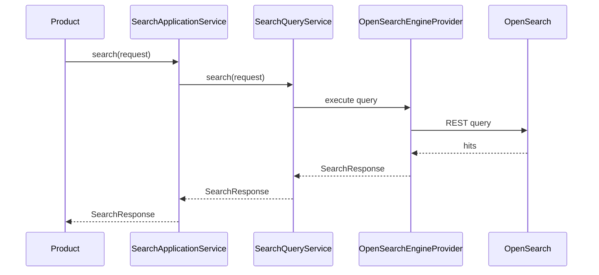

# SRH v1.0.0 — Architecture Guide

**Certified release:** v1.0.0 | Milestones SRH-001 through SRH-020

---

## 1. Platform Position

SRH (Search) is a **platform shared service** in the GovOS bounded context model. Products never access OpenSearch, embedding APIs, or search scheduling directly.

```
┌──────────────────────────────────────────────────────────────┐
│  Product (CMP, RTI, DOC, …)                                   │
│  {Product}SearchIntegration → SearchApplicationService        │
└────────────────────────────┬─────────────────────────────────┘
                             │
┌────────────────────────────▼─────────────────────────────────┐
│  govos-api — SearchApplicationService (orchestration)         │
│  SearchController (/api/v1/search)                            │
└────────────────────────────┬─────────────────────────────────┘
                             │
┌────────────────────────────▼─────────────────────────────────┐
│  govos-domain — com.govos.srh                                 │
│  ┌─────────────┐ ┌──────────────┐ ┌─────────────────────────┐ │
│  │ service.*   │ │ query.*      │ │ admin.*                 │ │
│  │ engine.*    │ │ ai.*         │ │ scheduler.*             │ │
│  │ production.*│ │ observability│ │                         │ │
│  └─────────────┘ └──────────────┘ └─────────────────────────┘ │
└────────────────────────────┬─────────────────────────────────┘
                             │ SearchEngineProvider
┌────────────────────────────▼─────────────────────────────────┐
│  OpenSearch 2.x (full-text + kNN vectors)                     │
└──────────────────────────────────────────────────────────────┘
         PostgreSQL (srh_* metadata tables)
```

---

## 2. Layering Rules

| Layer | Package | Responsibility |
|-------|---------|----------------|
| API | `com.govos.api.srh` | REST, DTO mapping, JWT, no business logic |
| Application | `SearchApplicationService` | Orchestration, transaction boundaries at API |
| Domain services | `com.govos.srh.service.impl` | Aggregate CRUD, index lifecycle |
| Query | `com.govos.srh.query` | Read-path query execution |
| Engine | `com.govos.srh.engine` | OpenSearch adapter (hidden from products) |
| AI | `com.govos.srh.ai` | Semantic search, embeddings, hybrid ranking |
| Production | `com.govos.srh.production` | Resilience, cache, metrics, guards |
| Scheduler | `com.govos.srh.scheduler` | Operational jobs (SRH-owned only) |
| Observability | `com.govos.srh.observability` | Tracing, monitoring (additive AOP) |
| Admin | `com.govos.srh.admin` | Dashboards, cluster monitoring, reindex |

**Dependency rule:** Products → API → Domain. Domain never depends on API or products.

---

## 3. DDD Boundaries

### Aggregates (PostgreSQL metadata)

| Aggregate | Table | Root entity |
|-----------|-------|-------------|
| Search Index | `srh_search_index` | `SearchIndex` |
| Search Document | `srh_search_document` | `SearchDocument` |
| Search Alias | `srh_search_alias` | `SearchAlias` |
| Sync Job | `srh_search_sync_job` | `SearchSyncJob` |
| Query History | `srh_search_query_history` | `SearchQueryHistory` |

### Ownership matrix

| Concern | Owner |
|---------|-------|
| Index schema / mapping | SRH |
| OpenSearch connectivity | SRH |
| Query engine | SRH |
| Embedding generation | SRH |
| Search scheduling | SRH |
| Distributed tracing | SRH |
| Business entity lifecycle | Product |
| When to index | Product (via integration) |
| Searchable payload content | Product |

---

## 4. Transaction Boundaries

- **Write path:** Product transaction → `SearchApplicationService` → domain service → PostgreSQL + synchronous OpenSearch index
- **Read path:** `SearchQueryService` → OpenSearch (no JPA transaction on query)
- **Reindex:** Async job metadata in PostgreSQL; engine operations via `SearchIndexService`
- **Scheduler:** Internal SRH jobs; never triggered by products

---

## 5. Multi-Tenancy

Every query and document operation is scoped by `organizationId`. Products must pass organization context; SRH enforces filtering at query layer.

---

## 6. Engine Abstraction

`SearchEngineProvider` interface hides OpenSearch. Products and API never import OpenSearch classes. v1.0 ships one implementation: `OpenSearchEngineProvider`.

---

## 7. Package Structure (24 subpackages)

```
com.govos.srh
├── admin/          Administration, dashboards
├── ai/             Semantic search, hybrid ranking
├── ai.provider/    OpenAI, Azure, Ollama, Mock
├── ai.job/         Embedding generation
├── ai.vector/      OpenSearch vector index
├── config/         SearchProperties, beans
├── dto/            Request/response DTOs
├── engine/         SearchEngineProvider
├── entity/         JPA entities
├── enums/          Status enums
├── event/          Domain event records (contracts)
├── exception/      Typed exceptions
├── mapper/         MapStruct mappers
├── observability/  Tracing, monitoring
├── production/     Resilience, cache, metrics
├── query/          Query service
├── repository/     JPA repositories
├── scheduler/      Scheduled jobs
├── service/        Domain interfaces
├── service.impl/   Domain implementations
├── validator/      Business validators
└── valueobject/    Value objects
```

---

## 8. Architecture Diagram — Request Flow



---

## 9. Certified Constraints (v1.0)

1. No product bypasses SRH for search operations
2. No OpenSearch scheduler — Spring `@Scheduled` only
3. No async indexing in v1.0
4. Observability is additive infrastructure (AOP)
5. Semantic algorithms unchanged post SRH-020 freeze

See [ARCHITECTURE_VALIDATION.md](./ARCHITECTURE_VALIDATION.md) for full certification checklist.
